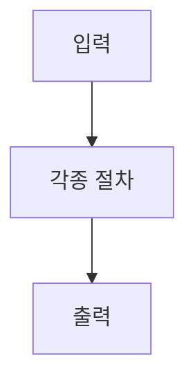
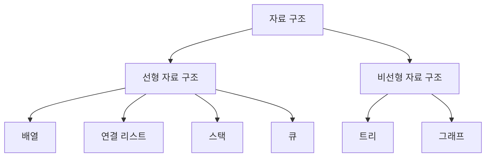
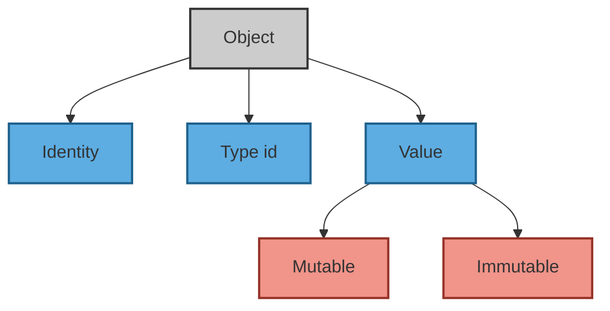

# 🧮 Algorithm 이론과 개념 정리  

##### 🗓️ 2025.06.02  
##### 📝 Writer : Moon19ht  

---

## 📚 목차  

- [1. 자료구조(Data Structure)의 정의](#1-자료구조의-정의)  
- [2. 변수](#2-변수)
- [3. 리스트](#3-리스트) 
- [4. 리스트의 연산](#4-리스트의-연산)

---

## 1. 자료구조의 정의  

### 1.1. 알고리즘(Algorithms)이란?  

알고리즘은 특정 문제를 해결하기 위한 명확하고 구체적인 단계들의 집합다. 컴퓨터 과학에서 알고리즘은 입력 데이터를 받아 원하는 결과를 출력하는 과정이며, 효율적인 알고리즘은 실행 시간과 자원 사용을 최소화한다.  



### 1.2. 자료구조(Data Structure)란?  

자료 구조는 데이터를 효율적으로 저장하고 관리하는 방법을 말한다. 데이터를 표현하고 조작하는 데 필요한 것으로써 삽입 · 수정 · 삭제 · 검색 · 정렬 · 병합 및 순회와 같은 기본적인 연산을 지원한다.  

### 1.3. 추상 자료형(Abstract Data Types, ADT)  

추상 자료형은 데이터의 유형과 그 데이터를 처리하는 연산을 정의하지만, 이러한 데이터가 실제로 어떻게 구현되는지는 숨긴다. 즉, 사용자는 데이터의 논리적인 구조와 기능에만 집중할 수 있으며, 내부 구현에 대한 신경은 쓰지 않아도 된다. 정보 은닉과 모듈화를 통해 코드의  
재사용성과 유지 보수성을 높여준다.  

### 1.4. 자료 구조의 분류  

- 선형 자료 구조 : 데이터를 일렬로 나열한 자료 구조다. 예를 들면 배열(Array) · 연결 리스트(Linked List)·스택(Stack)·큐(Queue)가 있다.  

- 비선형 자료 구조 : 데이터를 순서에 상관없이 계층 구조나 그래프 구조로 연결하는 자료 구조다. 예를 들면 트리(Tree) · 그래프(Graph)가 있다.  



## 2. 변수  

### 2.1. C언어의 변수  
- C 언어에서 변수를 선언하면, 그 변수는 메모리 주소를 할당받는다.  
- 변수에 값을 할당하면, 해당 메모리 주소에 그 값이 저장된다,  
- 참조 연산자 "&"를 사용하요 변수의 메모리 주소를 알 수 있다.  
- 포인터(Pointer)는 다른 변수의 메모리 주소를 저장하는 변수다.  

```c
#include <stdio.h>  
int main() {  
    int n = 300;  
    int* n_ptr = &n; // n의 메모리 주소를 n_ptr에 저장  
    int arr[] = {0, 1, 2};  
    char* s = "FA50";  
    return 0;  
}  
```

C 언어에서 자료형에 따라 값이 저장되는 영역이 다르다. 주로 다음 세 가지 영역이 있다.  

- Stack 영역 : 지역 변수를 저장하는 공간  
- Heap 영역 : 동적으로 할당된 변수를 저장하는 공간  
- Data 영역 : 전역 변수, 상수, 함수 코드 등이 저장되는 공간  

  

- 변수 `n`과 `arr`은 메모리 주소를 직접 나타낸다.  
    - n의 메모리 주소는 `0xFFF000BBC`다.  
    - 정수(int) 배열 arr의 메모리 주소는 배열의 시작 주소인 `0xFFF000BD4` 이다.  
- `int *`, `char *` 라고 선언한 변수 `n_ptr`와 `s`는 다른 변수를 가리키는 포인터다.  
    - `n_ptr`은 n이 저장된 메모리 주소(`0xFFF000BBC`)를 가리키는 변수다. 물론 `n_ptr` 자체도 메모리 주소(`0xFFF000BC0`)를 갖는다.  
    - `s` 는 문자(char) 배열의 시작 주소(`0x400594`)를 가리키는 변수다. `s` 자체도 메모리 주소(`0xFFF000BC8`)를 갖는다.  

`n_ptr`이라는 이름의 메모리 주소는 `n`이라는 이름의 메모리 주소를 담고 있으며, 그 메모리 위치에 정수 300이 저장되어 있다.  

### 2.2. 파이썬의 변수  

```python
n = 300  
n_ptr = n  
arr = [0, 1, 2]  
s = "FA50"  
```
파이썬에서는 모든 객체가 heap 공간에 저장되며, 변수는 객체를 가리킨다. 이는 C 언어와 파이썬의 큰 차이점이다. 즉, 파이썬의 변수는 객체를 참조하는 이름으로, C 언어의 포인터와는 다르게 동작한다.  

  

파이썬은 객체 지향 언어로, 모든 데이터는 객체로 취급된다. 파이썬에서 변수는 이러한 객체를 참조하는 이름일 뿐이다.  

예를 들어, `print(300)`이라는 명령은 다음과 같은 의미를 가진다.  

- 정수 객체를 만들고 300이라는 값을 부여한다.  
- 그리고 출력한다.  

```python
n = 300  
n_ptr = n  
``` 

- 값이 300인 정수 객체를 만들고 변수 `n`에 할당한다. → `n`은 값이 300인 정수 객체를 가리킨다.  
- `n`을 `n_ptr`에 할당한다. → `n_ptr`도 `n`이 가리키는 정수 객체를 가리킨다.  
- 따라서 `n`이나 `n_ptr` 모두 값 300을 참조할 수 있다.  

파이썬에서 변수를 객체에 붙이는 이름표라고 생각하는 것이 가장 쉽게 이해하는 방법이다.  

### 2.3. 파이썬은 데이터를 객체나 객체 간의 관계로 표현한다  

#### 2.3.1. 파이썬의 객체(Object)  
객체는 데이터를 추상화한 것으로 설명한다.  



모든 객체는 세 가지 속성을 가진다.  

- **아이덴티티(Identity)**: 객체를 고유하게 식별하는 값으로, 메모리 주소를 의미한다.  
- **유형(Type)**: 객체가 어떤 종류의 데이터를 가리키는지 나타내는 정보다.  
- **값(Value)**: 객체가 실제로 가지고 있는 데이터다.  

추상화는 프로그래밍에서 자료형을 정의할 때, 자료형에 사용할 수 있는 연산과 제약 조건만 보여주고 구현 세부 사항은 숨기는 것이다. 예를 들어, 스택 자료형을 정의할 때 푸시(push)와 팝(pop) 등의 연산만을 제공하고, 실제로 이 연산이 어떻게 구현되는지는 숨기는 것이다.  

#### 2.3.2. 파이썬의 자료형  

- **숫자형 객체**: 정수 · 실수 · 불(bool) 등. 한 번 만들어지면 변경되지 않는 불변형(immutable)이다.  
- **시퀀스형 객체**: 유한한 길이를 가지며 순서가 있는 집단. 인덱스를 통해 각 원소에 접근할 수 있다.  
  - 불변형: 문자열 · 튜플 등. 인덱싱은 가능하지만, 값을 변경할 수 없다.  
  - 가변형: 리스트 등. 인덱싱과 값의 변경이 가능하다.  
- **집합형 객체**: 집합(set). 중복이 없으며, 불변형 객체로 이루어진 집단이다. 순서가 없으며 크기를 변경할 수 있다.  
- **맵핑형 객체**: 사전(dict). 키(key)와 값(value) 쌍으로 구성되며, 키로 값을 조회하고 변경할 수 있다.  

위 자료형 중 문자열, 튜플, 리스트, 사전은 **이터러블(iterable)**이라 불리며, 이는 각 원소를 한 번에 하나씩 반환할 수 있는 객체를 의미한다.  

- **리스트 · 튜플 · 문자열**: 시퀀스이자 이터러블이다.  
- **사전**: 사전은 키에 대한 순서가 없으므로 이터러블이지만 시퀀스는 아니다.  

+ **인덱싱(Indexing)**  
: 자료 구조에서 특정 원소에 접근하는 방법  

+ **시퀀스(Sequence)**  
: 리스트, 튜플, 문자열처럼 각 원소의 순서가 정해진 객체  

+ **이터러블(Iterable)**  
: 반복 가능한 객체로, 한 번에 하나씩 원소를 반환할 수 있다.  

## 3. 리스트
> 파이썬은 리스트가 배열(array)을 대신한다.

 C 언어로 정수(int)형 배열을 만들고 실행한 것이다. 그림을 보면 정수가 연속된 메모리 주소에 저장되어 있다. C 언어에서 정수형은 4바이트(byte)를 차지하기 때문에, 배열의 각 원소가 저장된 메모리 주소의 간격이 4바이트다.

 

 문자형(char) 배열을 만든 경우다. 문자형은 1바이트를 차지하므로, 각 원소의 메모리 주소 간격이 1바이트로 일정하다.


#### 3.1. 배열의 특징

배열은 같은 자료형을 연속한 메모리에 저장하므로, 각 자료형이 차지하는 공간만큼의 메모리를 더하는 방식으로 임의의 원소에 빠르게 접근할 수 있다. 배열의 주요 특징은 다음과 같다.

- 임의 접근 가능: 배열의 인덱스를 통해 원하는 원소에 즉시 접근할 수 있다.
- 수정 시 비효율성: 원소를 추가하거나 삭제할 때 전체 배열 구조를 변경해야 하므로 시간이 많이 소요된다.
- 다양한 용도: 배열은 스택 · 큐 · 힙 · 해시 테이블 · 행렬 등 다양한 자료 구조의 기본으로 사용된다.
- 정렬 알고리즘의 기초: 배열은 정렬 알고리즘을 구현할 때 자주 사용된다.

배열과 관련된 용어를 그림으로 그려보면 다음과 같다.


#### 3.2. 파이썬의 리스트

파이썬에서는 리스트를 배열처럼 사용할 수 있다. 하지만 리스트는 배열과 달리 크기가 가변적이고, 다양한 자료형을 저장할 수 있는 특징이 있다.

- 리스트는 연속된 메모리에 **객체(objects)의 주소를 저장**한다. (파이썬의 모든 것은 객체다.)
- 같은 자료형뿐만 아니라, **다양한 자료(객체)를 저장**할 수 있다.
- 배열처럼 인덱스를 이용해 각 객체에 접근할 수 있으며, 슬라이싱(slicing) 기능도 제공한다.


리스트 `arr = [1, “a”, ("가", "나")]`의 구조를 보면 다양한 자료형의 객체들이 저장되어 있다. 각 객체는 메모리에 독립적으로 저장되지만, 리스트는 이러한 객체들을 참조함으로써 배열처럼 인덱스를 통해 각 원소에 접근할 수 있다.

문자, 정수, 실수와 같은 단일 자료형만 사용한다면, `array` 모듈의 `array` 클래스를 사용할 수 있다. 기본적인 사용법은 리스트와 유사하다.

#### 3.3. 리스트와 튜플의 차이점

튜플은 리스트와 유사한 자료 구조지만, 차이점은 다음과 같다.

- 리스트의 특징:
  - 동적 배열: 크기와 원소를 자유롭게 변경할 수 있다.
  - 다양한 자료형 지원: 서로 다른 자료형의 데이터를 하나의 리스트에 저장할 수 있다.
  - 인덱싱 및 슬라이싱: 배열처럼 리스트도 인덱싱과 슬라이싱을 통해 데이터에 접근할 수 있다.

- 튜플의 특징:
  - 정적 배열: 한 번 생성되면 크기와 원소를 변경할 수 없다.
  - 불변성: 튜플은 불변 객체로, 변경되지 않아야 하는 데이터를 저장하는 데 적합하다.
  
배열에 대한 구현이 필요하지 않으므로, 관련 문제를 풀어보며 이해를 돕도록 한다.

## 4. 리스트의 연산

### 4.1. 정수 배열에서 가장 큰 두 수를 찾기

>정수로 이루어진 배열이 주어질 때, 가장 큰 두 수를 찾아 [가장 큰 값, 둘째로 큰 값]을 반환하는 함수를 완성하라.
>입력: [3, -1, 5, 0, 7, 4, 9, 1], 출력: [9, 7]
>입력: [7], 출력: [7]

가장 쉽게 생각할 수 있는 방법은 배열을 내림차순으로 정렬한 후 앞에서 두 개의 값을 가져오는 것이다. 그러나 여기서는 배열을 순회하면서 직접 비교해 값을 찾는 방식으로 구현한다.

- 배열의 첫 번째와 두 번째 원소를 각각 `max1`, `max2`에 대입한다.
- 만약 `max2`가 `max1`보다 크다면 두 값을 교환한다.
- 세 번째 원소부터 마지막 원소까지 차례대로 `max1`, `max2`와 비교한다.
    - 비교하는 원소가 `max1`보다 크면 `max1`에 그 원소를 대입하고, `max1` 값을 `max2`에 대입한다.
    - 그렇지 않고, 그 원소가 `max2`보다 크면 `max2`에 대입한다.

```python
def find_max_two(arr: list[int]) -> list[int]:
    """정수 리스트에서 가장 큰 값 두 개를 찾아서 리스트로 반환한다.
    Arguments:
        arr (list): 정수 리스트
    Return:
        list: [가장 큰 값, 둘째로 큰 값]
    """
    if len(arr) < 2:
        return arr
    max1, max2 = arr[:2]
    if max2 > max1:
        max1, max2 = max2, max1
    for n in arr[2:]:
        if n > max1:
            max1, max2 = n, max1
        elif n > max2:
            max2 = n
    return [max1, max2]


# Test code
arr = [[3, -1, 5, 0, 7, 4, 9, 1], [7]]
for a in arr:
    print(f"{a}에서 가장 큰 두 값: {find_max_two(a)}")
```
실행 결과
```
[3, -1, 5, 0, 7, 4, 9, 1]에서 가장 큰 두 값: [9, 7]
[7]에서 가장 큰 두 값: [7]
```
이 코드는 배열이 길이가 1인 경우를 고려하여, 배열을 그대로 반환하는 조건문을 추가했다. 그 외의 경우에는 배열을 순회하며 가장 큰 두 값을 찾는다.