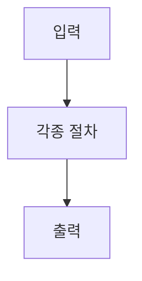
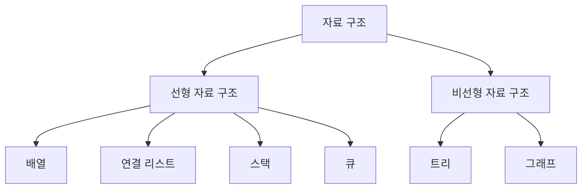
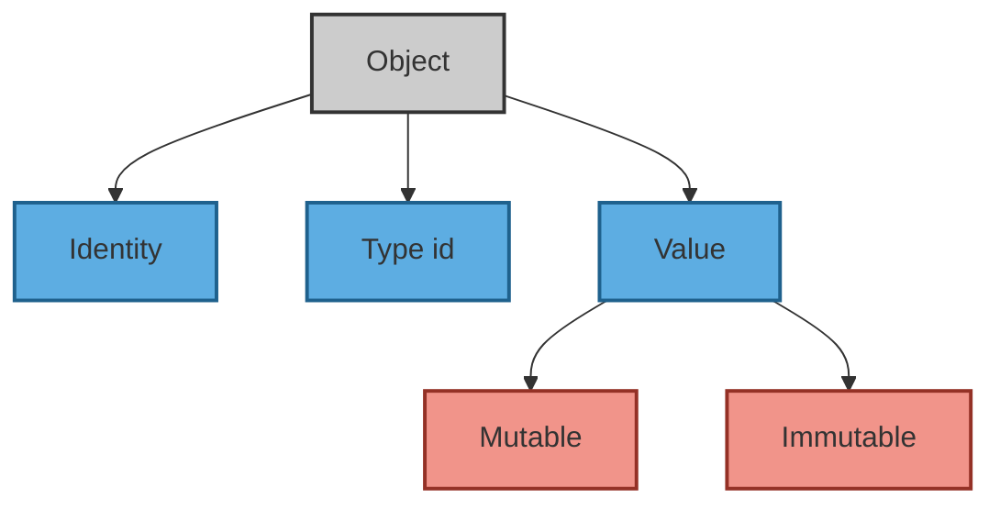

# 🧮 Algorithm 이론과 개념 정리  

##### 🗓️ 2025.06.02  
##### 📝 Writer : Moon19ht  

---

## 📚 목차  

- [1. 자료구조(Data Structure)의 정의](#1-자료구조의-정의)  
- [2. 변수](#2-변수)
- [3. 리스트](#3-리스트) 
- [4. 리스트의 연산](#4-리스트의-연산)

---

## 1. 자료구조의 정의  

### 1.1. 알고리즘(Algorithms)이란?  

알고리즘은 특정 문제를 해결하기 위한 명확하고 구체적인 단계들의 집합이다.

컴퓨터 과학에서 알고리즘은 입력 데이터를 받아 원하는 결과를 출력하는 과정이며, 효율적인 알고리즘은 실행 시간과 자원 사용을 최소화한다.  



### 1.2. 자료구조(Data Structure)란?  

자료 구조는 데이터를 효율적으로 저장하고 관리하는 방법을 말한다. 데이터를 표현하고 조작하는 데 필요한 것으로써 삽입 · 수정 · 삭제 · 검색 · 정렬 · 병합 및 순회와 같은 기본적인 연산을 지원한다.  

### 1.3. 추상 자료형(Abstract Data Types, ADT)  

추상 자료형은 데이터의 유형과 그 데이터를 처리하는 연산을 정의하지만, 이러한 데이터가 실제로 어떻게 구현되는지는 숨긴다. 즉, 사용자는 데이터의 논리적인 구조와 기능에만 집중할 수 있으며, 내부 구현에 대한 신경은 쓰지 않아도 된다. 정보 은닉과 모듈화를 통해 코드의  
재사용성과 유지 보수성을 높여준다.  

### 1.4. 자료 구조의 분류  

- 선형 자료 구조 : 데이터를 일렬로 나열한 자료 구조다. 예를 들면 배열(Array) · 연결 리스트(Linked List)·스택(Stack)·큐(Queue)가 있다.  

- 비선형 자료 구조 : 데이터를 순서에 상관없이 계층 구조나 그래프 구조로 연결하는 자료 구조다. 예를 들면 트리(Tree) · 그래프(Graph)가 있다.  



---

## 2. 변수  

### 2.1. C언어의 변수  
- C 언어에서 변수를 선언하면, 그 변수는 메모리 주소를 할당받는다.  
- 변수에 값을 할당하면, 해당 메모리 주소에 그 값이 저장된다,  
- 참조 연산자 "&"를 사용하요 변수의 메모리 주소를 알 수 있다.  
- 포인터(Pointer)는 다른 변수의 메모리 주소를 저장하는 변수다.  

```c
#include <stdio.h>  
int main() {  
    int n = 300;  
    int* n_ptr = &n; // n의 메모리 주소를 n_ptr에 저장  
    int arr[] = {0, 1, 2};  
    char* s = "FA50";  
    return 0;  
}  
```

C 언어에서 자료형에 따라 값이 저장되는 영역이 다르다. 주로 다음 세 가지 영역이 있다.  

- Stack 영역 : 지역 변수를 저장하는 공간  
- Heap 영역 : 동적으로 할당된 변수를 저장하는 공간  
- Data 영역 : 전역 변수, 상수, 함수 코드 등이 저장되는 공간  

  

- 변수 `n`과 `arr`은 메모리 주소를 직접 나타낸다.  
    - n의 메모리 주소는 `0xFFF000BBC`다.  
    - 정수(int) 배열 arr의 메모리 주소는 배열의 시작 주소인 `0xFFF000BD4` 이다.  
- `int *`, `char *` 라고 선언한 변수 `n_ptr`와 `s`는 다른 변수를 가리키는 포인터다.  
    - `n_ptr`은 n이 저장된 메모리 주소(`0xFFF000BBC`)를 가리키는 변수다. 물론 `n_ptr` 자체도 메모리 주소(`0xFFF000BC0`)를 갖는다.  
    - `s` 는 문자(char) 배열의 시작 주소(`0x400594`)를 가리키는 변수다. `s` 자체도 메모리 주소(`0xFFF000BC8`)를 갖는다.  

`n_ptr`이라는 이름의 메모리 주소는 `n`이라는 이름의 메모리 주소를 담고 있으며, 그 메모리 위치에 정수 300이 저장되어 있다.  

### 2.2. 파이썬의 변수  

```python
n = 300  
n_ptr = n  
arr = [0, 1, 2]  
s = "FA50"  
```
파이썬에서는 모든 객체가 heap 공간에 저장되며, 변수는 객체를 가리킨다. 이는 C 언어와 파이썬의 큰 차이점이다. 즉, 파이썬의 변수는 객체를 참조하는 이름으로, C 언어의 포인터와는 다르게 동작한다.  

  

파이썬은 객체 지향 언어로, 모든 데이터는 객체로 취급된다. 파이썬에서 변수는 이러한 객체를 참조하는 이름일 뿐이다.  

예를 들어, `print(300)`이라는 명령은 다음과 같은 의미를 가진다.  

- 정수 객체를 만들고 300이라는 값을 부여한다.  
- 그리고 출력한다.  

```python
n = 300  
n_ptr = n  
``` 

- 값이 300인 정수 객체를 만들고 변수 `n`에 할당한다. → `n`은 값이 300인 정수 객체를 가리킨다.  
- `n`을 `n_ptr`에 할당한다. → `n_ptr`도 `n`이 가리키는 정수 객체를 가리킨다.  
- 따라서 `n`이나 `n_ptr` 모두 값 300을 참조할 수 있다.  

파이썬에서 변수를 객체에 붙이는 이름표라고 생각하는 것이 가장 쉽게 이해하는 방법이다.  

### 2.3. 파이썬은 데이터를 객체나 객체 간의 관계로 표현한다  

#### 2.3.1. 파이썬의 객체(Object)  
객체는 데이터를 추상화한 것으로 설명한다.  



모든 객체는 세 가지 속성을 가진다.  

- **아이덴티티(Identity)**: 객체를 고유하게 식별하는 값으로, 메모리 주소를 의미한다.  
- **유형(Type)**: 객체가 어떤 종류의 데이터를 가리키는지 나타내는 정보다.  
- **값(Value)**: 객체가 실제로 가지고 있는 데이터다.  

추상화는 프로그래밍에서 자료형을 정의할 때, 자료형에 사용할 수 있는 연산과 제약 조건만 보여주고 구현 세부 사항은 숨기는 것이다. 예를 들어, 스택 자료형을 정의할 때 푸시(push)와 팝(pop) 등의 연산만을 제공하고, 실제로 이 연산이 어떻게 구현되는지는 숨기는 것이다.  

#### 2.3.2. 파이썬의 자료형  

- **숫자형 객체**: 정수 · 실수 · 불(bool) 등. 한 번 만들어지면 변경되지 않는 불변형(immutable)이다.  
- **시퀀스형 객체**: 유한한 길이를 가지며 순서가 있는 집단. 인덱스를 통해 각 원소에 접근할 수 있다.  
  - 불변형: 문자열 · 튜플 등. 인덱싱은 가능하지만, 값을 변경할 수 없다.  
  - 가변형: 리스트 등. 인덱싱과 값의 변경이 가능하다.  
- **집합형 객체**: 집합(set). 중복이 없으며, 불변형 객체로 이루어진 집단이다. 순서가 없으며 크기를 변경할 수 있다.  
- **맵핑형 객체**: 사전(dict). 키(key)와 값(value) 쌍으로 구성되며, 키로 값을 조회하고 변경할 수 있다.  

위 자료형 중 문자열, 튜플, 리스트, 사전은 **이터러블(iterable)**이라 불리며, 이는 각 원소를 한 번에 하나씩 반환할 수 있는 객체를 의미한다.  

- **리스트 · 튜플 · 문자열**: 시퀀스이자 이터러블이다.  
- **사전**: 사전은 키에 대한 순서가 없으므로 이터러블이지만 시퀀스는 아니다.  

+ **인덱싱(Indexing)**  
: 자료 구조에서 특정 원소에 접근하는 방법  

+ **시퀀스(Sequence)**  
: 리스트, 튜플, 문자열처럼 각 원소의 순서가 정해진 객체  

+ **이터러블(Iterable)**  
: 반복 가능한 객체로, 한 번에 하나씩 원소를 반환할 수 있다.  

---

## 3. 리스트
> 파이썬은 리스트가 배열(array)을 대신한다.

 C 언어로 정수(int)형 배열을 만들고 실행한 것이다. 그림을 보면 정수가 연속된 메모리 주소에 저장되어 있다. C 언어에서 정수형은 4바이트(byte)를 차지하기 때문에, 배열의 각 원소가 저장된 메모리 주소의 간격이 4바이트다.

 

 문자형(char) 배열을 만든 경우다. 문자형은 1바이트를 차지하므로, 각 원소의 메모리 주소 간격이 1바이트로 일정하다.


#### 3.1. 배열의 특징

배열은 같은 자료형을 연속한 메모리에 저장하므로, 각 자료형이 차지하는 공간만큼의 메모리를 더하는 방식으로 임의의 원소에 빠르게 접근할 수 있다. 배열의 주요 특징은 다음과 같다.

- 임의 접근 가능: 배열의 인덱스를 통해 원하는 원소에 즉시 접근할 수 있다.
- 수정 시 비효율성: 원소를 추가하거나 삭제할 때 전체 배열 구조를 변경해야 하므로 시간이 많이 소요된다.
- 다양한 용도: 배열은 스택 · 큐 · 힙 · 해시 테이블 · 행렬 등 다양한 자료 구조의 기본으로 사용된다.
- 정렬 알고리즘의 기초: 배열은 정렬 알고리즘을 구현할 때 자주 사용된다.

배열과 관련된 용어를 그림으로 그려보면 다음과 같다.


#### 3.2. 파이썬의 리스트

파이썬에서는 리스트를 배열처럼 사용할 수 있다. 하지만 리스트는 배열과 달리 크기가 가변적이고, 다양한 자료형을 저장할 수 있는 특징이 있다.

- 리스트는 연속된 메모리에 **객체(objects)의 주소를 저장**한다. (파이썬의 모든 것은 객체다.)
- 같은 자료형뿐만 아니라, **다양한 자료(객체)를 저장**할 수 있다.
- 배열처럼 인덱스를 이용해 각 객체에 접근할 수 있으며, 슬라이싱(slicing) 기능도 제공한다.


리스트 `arr = [1, “a”, ("가", "나")]`의 구조를 보면 다양한 자료형의 객체들이 저장되어 있다. 각 객체는 메모리에 독립적으로 저장되지만, 리스트는 이러한 객체들을 참조함으로써 배열처럼 인덱스를 통해 각 원소에 접근할 수 있다.

문자, 정수, 실수와 같은 단일 자료형만 사용한다면, `array` 모듈의 `array` 클래스를 사용할 수 있다. 기본적인 사용법은 리스트와 유사하다.

#### 3.3. 리스트와 튜플의 차이점

튜플은 리스트와 유사한 자료 구조지만, 차이점은 다음과 같다.

- 리스트의 특징:
  - 동적 배열: 크기와 원소를 자유롭게 변경할 수 있다.
  - 다양한 자료형 지원: 서로 다른 자료형의 데이터를 하나의 리스트에 저장할 수 있다.
  - 인덱싱 및 슬라이싱: 배열처럼 리스트도 인덱싱과 슬라이싱을 통해 데이터에 접근할 수 있다.

- 튜플의 특징:
  - 정적 배열: 한 번 생성되면 크기와 원소를 변경할 수 없다.
  - 불변성: 튜플은 불변 객체로, 변경되지 않아야 하는 데이터를 저장하는 데 적합하다.
  
배열에 대한 구현이 필요하지 않으므로, 관련 문제를 풀어보며 이해를 돕도록 한다.

---

## 4. 리스트의 연산

### 4.1. 정수 배열에서 가장 큰 두 수를 찾기

>정수로 이루어진 배열이 주어질 때, 가장 큰 두 수를 찾아 [가장 큰 값, 둘째로 큰 값]을 반환하는 함수를 완성하라.
>입력: [3, -1, 5, 0, 7, 4, 9, 1], 출력: [9, 7]
>입력: [7], 출력: [7]

가장 쉽게 생각할 수 있는 방법은 배열을 내림차순으로 정렬한 후 앞에서 두 개의 값을 가져오는 것이다. 그러나 여기서는 배열을 순회하면서 직접 비교해 값을 찾는 방식으로 구현한다.

- 배열의 첫 번째와 두 번째 원소를 각각 `max1`, `max2`에 대입한다.
- 만약 `max2`가 `max1`보다 크다면 두 값을 교환한다.
- 세 번째 원소부터 마지막 원소까지 차례대로 `max1`, `max2`와 비교한다.
    - 비교하는 원소가 `max1`보다 크면 `max1`에 그 원소를 대입하고, `max1` 값을 `max2`에 대입한다.
    - 그렇지 않고, 그 원소가 `max2`보다 크면 `max2`에 대입한다.

```python
def find_max_two(arr: list[int]) -> list[int]:
    """정수 리스트에서 가장 큰 값 두 개를 찾아서 리스트로 반환한다.
    Arguments:
        arr (list): 정수 리스트
    Return:
        list: [가장 큰 값, 둘째로 큰 값]
    """
    if len(arr) < 2:
        return arr
    max1, max2 = arr[:2]
    if max2 > max1:
        max1, max2 = max2, max1
    for n in arr[2:]:
        if n > max1:
            max1, max2 = n, max1
        elif n > max2:
            max2 = n
    return [max1, max2]


# Test code
arr = [[3, -1, 5, 0, 7, 4, 9, 1], [7]]
for a in arr:
    print(f"{a}에서 가장 큰 두 값: {find_max_two(a)}")
```
실행 결과
```
[3, -1, 5, 0, 7, 4, 9, 1]에서 가장 큰 두 값: [9, 7]
[7]에서 가장 큰 두 값: [7]
```
이 코드는 배열이 길이가 1인 경우를 고려하여, 배열을 그대로 반환하는 조건문을 추가했다. 그 외의 경우에는 배열을 순회하며 가장 큰 두 값을 찾는다.

### 4.2. 회문(Palindromes) 찾기
> 주어진 문자열이 회문이면 True, 회문이 아니면 False를 반환하라.
> 입력: madam, 출력: True
> 입력: tomato, 출력: False 

"오디오, 기러기, 오레오" 같은 앞으로 읽어도, 뒤로 읽어도 같은 단어(회문)인지 검사하는 함수를 만들자.

#### 4.2.1. 문자열의 슬라이싱을 이용하기

문자열(string)은 문자의 배열로, 그 안의 개별 문자를 수정할 수는 없지만 리스트처럼 인덱싱과 슬라이싱을 할 수 있다. 문자열 슬라이싱 기능을 사용해 회문인지 간단하게 검사할 수 있다.

```python
word = "racecar"
if word == word[::-1]:
    print(True)
else:
    print(False)
```

### 4.2.2. 두 포인터(Two Pointers)를 이용한 방법

배열이나 문자열에서 두 개의 포인터를 사용하는 방법을 많이 사용한다. 여기서도 두 개의 포인터를 활용하여 회문을 검사하는 방법을 구현해본다.

아래 그림처럼 **두 포인터**를 문자열의 양쪽 끝에서 시작하여, 가운데로 이동하면서 문자를 비교한다. 두 문자가 다르면 그 문자열은 회문이 아니다. 만약 포인터들이 서로 교차하거나 같은 위치에 도달하면 회문이다.


- 왼쪽 포인터는 문자열의 첫 번째 인덱스(`0`)에, 오른쪽 포인터는 마지막 인덱스에 위치한다.
- 왼쪽 포인터가 오른쪽 포인터보다 작을 동안, 두 포인터가 가리키는 문자를 비교한다.
  - 만약 두 문자가 다르면 `False`를 반환한다.
- 반복문을 끝까지 통과하면 `True`를 반환한다.

```python
def is_palindrome(word: str) -> bool:
    """문자열 word가 회문(palindrome)인지 검사한다.
    Arguments:
        word (str): 회문인지 검사할 문자열
    Return:
        bool: 회문이면 True, 그렇지 않으면 False를 반환
    """
    left: int = 0
    right: int = len(word)-1
    while left < right:
        if word[left] != word[right]:
            return False
        left, right = left + 1, right - 1
    return True


# Test code
words = ["racecar", "rotor", "tomato", "별똥별", "코끼리"]
for word in words:
    print(f"Is '{word}' palindrome?  {is_palindrome(word)}")
```

실행 결과
```
Is 'racecar' palindrome?  True
Is 'rotor' palindrome?  True
Is 'tomato' palindrome?  False
Is '별똥별' palindrome?  True
Is '코끼리' palindrome?  False
```

### 4.3. 0과 1로 구성된 배열을 정렬하기

> 0과 1로 이루어진 배열이 있다. 배열 자체를 오름차순으로 정렬하라.
>입력: [1, 0, 1, 1, 1, 1, 1, 0, 0, 0], 출력: [0, 0, 0, 0, 1, 1, 1, 1, 1, 1]
>입력: [1, 1], 출력: [1, 1]

#### 4.3.1. count 메서드 이용하기

- 0과 1만 있으므로, count() 메서드를 이용하여 0과 1의 개수를 센다.
- 해당 개수만큼 0과 1을 채운다.

```python
def  bin_array_sort(arr: list[int]) -> None:  
    arr[:] = [0] * arr.count(0) + [1] * arr.count(1)  


# Test code 
for arr in ([1, 0, 1, 1, 1, 1, 1, 0, 0, 0], [1, 1]):  
    bin_array_sort(arr)  
    print(arr)
```

실행 결과
```
[0, 0, 0, 0, 1, 1, 1, 1, 1, 1]
[1, 1]
```
위와 같이 코드를 짤 때 주의할 점은, 배열 자체를 정렬하라고 했기 때문에 슬라이싱을 이용하여 원래 배열의 값을 바꿔야 한다는 것이다.

> arr[:] = ...

#### 4.3.2. 포인터 두 개를 이용하기
0을 앞쪽에 놓고 1을 뒤쪽에 배치하면 되므로, 앞쪽에 있는 1과 뒤쪽에 있는 0을 찾아 서로 교환한다. 즉, 왼쪽 포인터는 오른쪽으로 이동하면서 1을 찾고, 오른쪽 포인터는 왼쪽으로 이동하면서 0을 찾는다. 각각 1과 0을 찾았고, 두 포인터가 서로 교차하지 않았다면 1과 0을 서로 교환한다.


```python
def bin_array_sort(arr: list[int]) -> None:
    """0과 1로 이루어진 배열 arr를 오름차순으로 정렬한다.
    Arguments:
        arr (list[int]): 0과 1로 이루어진 배열
    Return:
        None: 배열 arr 자체를 정렬한다.
    """
    left: int = 0
    right: int = len(arr) - 1
    while left < right:
        while left < len(arr) and arr[left] == 0:
            left += 1
        while right >= 0 and arr[right] == 1:
            right -= 1
        if left < right:
            arr[left], arr[right] = 0, 1
            left, right = left + 1, right - 1


# Test code 
for arr in ([1, 0, 1, 1, 1, 1, 1, 0, 0, 0], [1, 1]):  
    bin_array_sort(arr)  
    print(arr)
```

실행 결과
```
[0, 0, 0, 0, 1, 1, 1, 1, 1, 1]
[1, 1]
```

### 4.4. 제시된 합을 가진 부분 배열 찾기 

> 정렬되지 않은 양의 정수로 이루어진 배열 A가 있다. 연속된 원소를 더한 값이 제시된 값 S와 같은 부분 배열을 찾아라. (인덱스 기준은 1이다.)
> 입력: arr = [1, 2, 3, 7, 5], s = 12, 출력: [2, 4]
>    인덱스 2부터 4까지의 합: 2 + 3 + 7 = 12
> 입력: arr = [1, 2, 3, 4, 5, 6, 7, 8, 9, 10], s = 15, 출력: [1, 5] 

#### 4.4.1. 이중 반복문으로 풀기

- i는 인덱스 0부터 마지막 인덱스까지 반복한다.
  - 부분 배열의 합을 0으로 초기화한다.
  - j는 i부터 마지막 인덱스까지 반복한다.
    - 배열의 값을 더한다.
    - 누적한 값이 제시된 값과 같으면 인덱스를 반환한다.
- 반복문을 빠져나오면 답이 없으므로 -1을 반환한다.

```python
def find_sub_array(arr: list[int], s: int) -> list[int]:
    """배열 arr에서 연속한 원소의 합이 s인 부분 배열의 인덱스를 구한다.
    Arguments:
        arr (list[int]): 양의 정수
        s: 부분 배열의 합
    Return:
        list[int]: 부분 배열의 인덱스, 조건을 만족하는 부분 배열이 없으면 [-1]
     """
    for i in range(len(arr)):
        sub_total: int = 0
        for j in range(i, len(arr)):
            sub_total += arr[j]
            if sub_total == s:
                return [i+1, j+1]
    return [-1]


# Test code
sample1 = ([1, 2, 3, 7, 5], 12)
sample2 = ([1, 2, 3, 4, 5, 6, 7, 8, 9, 10], 15)
for arr, s in (sample1, sample2):
    print(find_sub_array(arr, s))
```

실행 결과
```
[2, 4]
[1, 5]
```

#### 4.4.2. 포인터 두 개를 이용하기

이중 반복문을 사용하지 않고 문제를 해결하려면, 두 개의 포인터를 사용하는 방법을 떠올릴 수 있다. 
두 포인터를 사용하면 배열을 한 번만 순회하면서 필요한 조건을 만족할 수 있기 때문에, 시간 복잡도가 더 효율적인 O(n)으로 줄어든다.

아래 그림은 예시로 주어진 값에서 합이 12인 부분 배열을 찾는 과정을 설명하고 있다.


  
- 왼쪽 포인터와 오른쪽 포인터를 설정한다.
- 오른쪽 포인터를 오른쪽으로 이동시키며, 해당 위치의 배열 원소를 더한다.
- 더한 값이 S보다 작으면, 오른쪽 포인터를 증가시키고 계속 값을 더한다.
- 더한 값이 S보다 크면, S와 같거나 작아질 때까지 왼쪽 포인터가 가리키는 값을 뺀다.
- 더한 값이 S와 같으면 [왼쪽 포인터 + 1, 오른쪽 포인터 + 1]을 반환한다.
- 배열의 끝까지 갔는데도 S와 같은 값이 없으면 [-1]을 반환한다.

```python
def find_sub_array(arr: list[int], s: int) -> list[int]:
    """배열 arr에서 연속한 원소의 합이 s인 부분 배열의 인덱스를 구한다.
    Arguments:
        arr (list[int]): 양의 정수
        s: 부분 배열의 합
    Return:
        list[int]: 부분 배열의 인덱스, 조건을 만족하는 부분 배열이 없으면 [-1]
     """
    left: int = 0
    sub_total: int = 0
    for right in range(len(arr)):
        sub_total += arr[right]
        while left < right and sub_total > s:
            sub_total -= arr[left]
            left += 1
        if sub_total == s:
            return [left+1, right+1]
    return [-1]


# Test code
sample1 = ([1, 2, 3, 7, 5], 12)
sample2 = ([1, 2, 3, 4, 5, 6, 7, 8, 9, 10], 15)
sample3 = ([1, 2, 3, 4], 0)
for arr, s in (sample1, sample2, sample3):
    print(find_sub_array(arr, s))
```

실행 결과
```
[2, 4]
[1, 5]
[-1]
```
