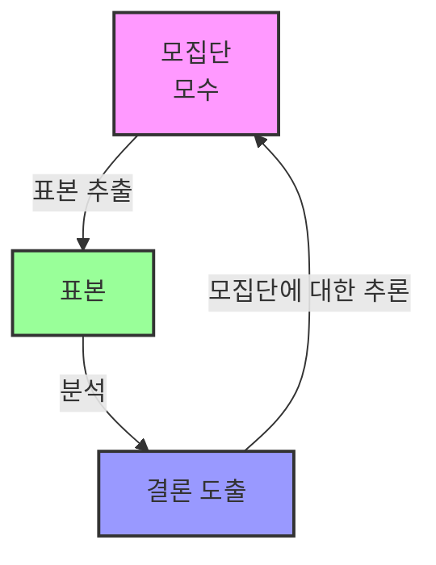
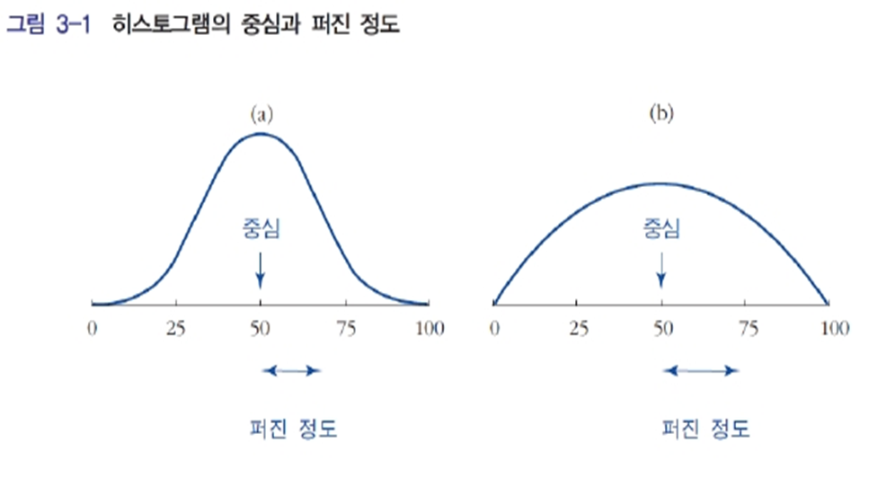
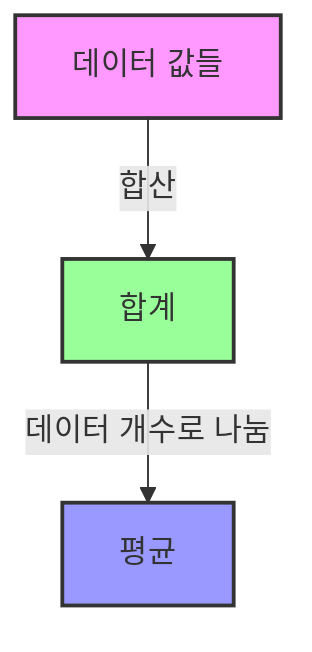
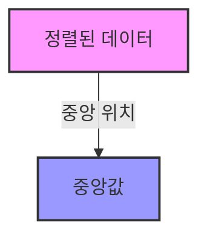
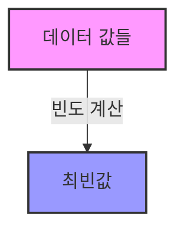

# 🧠 Deep Learning 이론

##### 🗓️ 2025.07.01
##### 📝 Writer : Moon19ht

---

## 📚 목차

---

## 📊 데이터 분석을 위한 통계학 기초

### 1. 왜 통계학이 중요한가?

통계학은 **데이터 기반의 의사결정**과 **미래 예측**, **효율성 향상** 등을 가능하게 하는 핵심 도구입니다. 그 필요성은 다음과 같습니다:

#### 1. 데이터 기반 의사결정

* 통계학은 데이터를 체계적으로 분석하여 신뢰할 수 있는 근거를 제공합니다.
* 직관이나 경험이 아닌 **수치화된 데이터**를 기반으로 전략을 수립할 수 있습니다.

> 예: 기업이 제품별 매출 데이터를 분석해 마케팅 예산을 효과적으로 배분

#### 2. 예측과 추론

* 과거 데이터를 분석하여 미래의 사건을 예측하거나, \*\*전체 집단(모집단)\*\*에 대한 정보를 \*\*일부 데이터(표본)\*\*를 통해 추론합니다.

> 예: 기상청의 날씨 예측, 금융시장의 리스크 분석

#### 3. 문제 해결 및 원인 규명

* 복잡한 문제를 **데이터 기반의 구조화된 방식**으로 접근하고, 해답을 도출합니다.

> 예: 병원에서 환자 기록을 분석해 질병 발생 원인 파악

#### 4. 자원 최적화와 효율성 제고

* 통계 기법을 통해 인력, 비용, 시간 등의 자원을 **최적으로 배분**할 수 있습니다.

> 예: 물류 회사가 배송 데이터를 분석해 최단 경로 자동화

#### 5. 모든 분야에서의 활용성

* 경제, 경영, 사회, 의료, 공학 등 거의 모든 분야에서 필수적으로 활용됩니다.

> 예: 공학에서 제품 불량률 분석, 교육학에서 학습 효과 검증

---

### 2. 통계학이란 무엇인가?

통계학은 **데이터의 수집, 정리, 분석, 해석, 표현**을 체계적으로 수행하는 학문입니다. 단순한 숫자 계산이 아닌, **의미 있는 정보**를 도출하여 현실의 문제를 해결하는 데 초점을 둡니다.

> 즉, 통계학은 “숫자 너머의 의미”를 탐색하는 도구입니다.

---

### 3. 통계학의 두 가지 큰 축

통계학은 분석 목적과 방식에 따라 다음과 같이 분류됩니다:

#### 3.1 기술통계(Descriptive Statistics)

* 데이터의 **전체적인 분포와 특성**을 요약 및 시각화
* 사용 예: 평균, 중앙값, 표준편차, 히스토그램, 박스플롯 등

#### 3.2 추론통계(Inferential Statistics)

* **표본**을 바탕으로 **모집단 전체**에 대한 추론 수행
* 사용 예: 가설 검정, 신뢰 구간, 회귀분석, 분산분석(ANOVA) 등

---

### 4. 통계 분석이란?

통계 분석은 **수집된 데이터를 해석하여 유의미한 인사이트를 도출하고, 예측 모델을 구축**하는 과정입니다. 이는 단순한 숫자 계산이 아니라, 다음과 같은 목적을 달성하는 것을 포함합니다:

* 문제 해결 및 의사결정 지원
* 패턴 발견 및 상관관계 탐색
* 미래에 대한 예측 및 시뮬레이션

---

### 5. 통계 분석 절차

정교한 분석을 위해 통계학은 다음과 같은 구조적 접근을 따릅니다:

1. **문제 정의**: 분석의 목적과 핵심 질문 설정
2. **데이터 수집**: 설문조사, 센서, DB, 크롤링 등 다양한 방식으로 자료 확보
3. **데이터 정제**: 결측치 보완, 이상치 제거, 변수 변환 등 전처리
4. **데이터 분석**: 기술통계 → 추론통계 순으로 탐색 및 모델링 수행
5. **결과 해석 및 시각화**: 분석 결과를 해석하고, 시각적 표현을 통해 전달력 강화

---

### 6. 모집단과 표본의 관계

* **모집단(Population)**: 분석 대상 전체 (예: 전국 성인의 소득)
* **모수(Parameter)**: 모집단의 특성을 나타내는 값 (예: 평균 소득)
* **표본(Sample)**: 모집단 중 일부를 추출한 데이터 (예: 1,000명의 설문 응답자)

> 통계학의 핵심은 "표본을 바탕으로 모집단을 이해하는 것"에 있습니다.

* **대표성 있는 표본 추출**이 중요: 표본이 편향되면 전체에 대한 잘못된 결론을 도출할 수 있습니다.
* 일반적으로 **표본 수가 크고 무작위로 추출될수록** 신뢰도는 증가합니다.


---

### 7. 자료의 중심과 퍼진 정도
히스토그램에서 자료를 요약할 때 중심 (평균, 중앙값) 과 중심 주위로 퍼진 정도(표준편차, 사분위수 범위)를 주로 사용한다.




### 8. 평균, 중앙값, 최빈치

#### 1. 평균 (Mean)
- **정의**: 데이터 값들의 합을 데이터 개수로 나눈 값.
- **특징**: 데이터의 중심을 나타내며, 모든 값을 고려하므로 극단값(이상치)에 민감함.
- **사용 예**: 평균 소득, 평균 점수 등.



#### 2. 중앙값 (Median)
- **정의**: 데이터를 크기 순으로 정렬했을 때, 중앙에 위치한 값.
- **특징**: 극단값(이상치)에 영향을 받지 않으며, 데이터의 분포를 잘 나타냄.
- **사용 예**: 중간 소득, 중간 점수 등.



#### 3. 최빈치 (Mode)
- **정의**: 데이터에서 가장 자주 나타나는 값.
- **특징**: 데이터의 빈도를 나타내며, 여러 개의 최빈값이 존재할 수 있음.


- **사용 예**: 가장 인기 있는 제품, 가장 많이 선택된 답변 등.


---


아래는 전체 문서를 보완된 내용과 함께 정돈된 형식으로 재작성한 것입니다. 코드, 설명, 수식, 시각화까지 통합해 \*\*"Python을 활용한 평균, 분산, 표준편차의 이해와 시각화"\*\*를 중심으로 구성했습니다.

---

## 📊 Python을 활용한 평균, 분산, 표준편차 계산 및 시각화

### 1. 데이터 생성 및 기술통계량 계산

```python
import numpy as np

# 정규분포를 따르는 데이터 생성
x = np.random.normal(loc=0, scale=1, size=1000)

# 기술통계량 계산
mean = np.mean(x)
median = np.median(x)
std = np.std(x)               # 모표준편차 (N)
var = np.var(x)               # 모분산 (N)
sample_std = np.std(x, ddof=1)  # 표본 표준편차 (N-1)
sample_var = np.var(x, ddof=1)  # 표본 분산 (N-1)

# 결과 출력
print(f"Mean (평균): {mean:.4f}")
print(f"Median (중앙값): {median:.4f}")
print(f"Standard Deviation (표준편차, N): {std:.4f}")
print(f"Variance (분산, N): {var:.4f}")
print(f"Sample Std Dev (표본 표준편차, N-1): {sample_std:.4f}")
print(f"Sample Variance (표본 분산, N-1): {sample_var:.4f}")
```

---

### 2. 통계 개념 설명

#### ✅ 평균 (Mean)

* **정의**: 데이터 값들의 총합을 데이터 개수로 나눈 값
* **계산식**:

  $$
  \mu = \frac{1}{N} \sum_{i=1}^{N} x_i
  $$
* **특징**: 데이터의 중심 위치를 나타냄

---

#### ✅ 분산 (Variance)

* **정의**: 평균으로부터 각 데이터가 얼마나 떨어져 있는지를 제곱하여 평균 낸 값
* **계산식 (모분산)**:

  $$
  \sigma^2 = \frac{1}{N} \sum_{i=1}^{N}(x_i - \mu)^2
  $$
* **계산식 (표본 분산)**:

  $$
  s^2 = \frac{1}{N - 1} \sum_{i=1}^{N}(x_i - \bar{x})^2
  $$
* **특징**: 단위가 제곱으로 표현되어 해석이 직관적이지 않음

---

#### ✅ 표준편차 (Standard Deviation)

* **정의**: 분산의 제곱근으로, 데이터 퍼짐 정도를 원래 단위로 표현
* **계산식**:

  $$
  \sigma = \sqrt{\sigma^2}, \quad s = \sqrt{s^2}
  $$
* **특징**: 분포의 폭을 직관적으로 이해하는 데 가장 많이 사용됨

---

### 3. 히스토그램 시각화

```python
import matplotlib.pyplot as plt

plt.hist(x, bins=30, edgecolor='black', alpha=0.7)
plt.axvline(mean, color='red', linestyle='dashed', linewidth=2, label=f'Mean: {mean:.2f}')
plt.axvline(mean + std, color='green', linestyle='dotted', linewidth=2, label=f'+1 STD: {mean + std:.2f}')
plt.axvline(mean - std, color='green', linestyle='dotted', linewidth=2, label=f'-1 STD: {mean - std:.2f}')
plt.title("Histogram with Mean and Standard Deviation")
plt.xlabel("Value")
plt.ylabel("Frequency")
plt.legend()
plt.grid(True)
plt.show()
```

> 위 그래프는 데이터가 평균을 중심으로 어떤 범위에 얼마나 분포되어 있는지 시각적으로 보여준다. ±1 표준편차 구간에 데이터의 약 68%가 분포하는 특징도 확인할 수 있다.

---

## 🧮 행렬(Matrix) 완전 가이드

### 📌 1. 행렬이란?

행렬은 수학에서 **숫자, 기호, 또는 수식 등을 직사각형 형태의 2차원 배열**로 정리한 구조입니다.

* `m x n` 행렬: `m`개의 행(row)과 `n`개의 열(column)로 구성
* 일반적인 표기: $A = \begin{bmatrix} a_{11} & a_{12} & \dots \\ a_{21} & a_{22} & \dots \end{bmatrix}$

#### ✅ Python에서의 표현 (NumPy 사용)

```python
import numpy as np
A = np.array([[1, 2], [3, 4]])
```

---

### 🧮 2. 행렬의 기본 연산

#### 1. 행렬 덧셈 (Matrix Addition)

두 행렬 A, B의 **같은 위치 원소끼리 더함**

* **조건**: 두 행렬의 크기가 같아야 함

```python
C = A + B
##### 수식:

$$
C = A + B \quad \text{where} \quad c_{ij} = a_{ij} + b_{ij}
$$

##### 예시:

```python
A = np.array([[1, 2], [3, 4]])
B = np.array([[5, 6], [7, 8]])
C = A + B
# 결과: [[ 6  8]
#        [10 12]]
```

---

#### 2. 행렬 곱셈 (Matrix Multiplication)

행렬 A의 \*\*행(row)\*\*과 B의 **열(column)** 간의 **내적(dot product)**

* **조건**: A의 열 수 = B의 행 수

##### 수식:

$$
C_{ij} = \sum_{k=1}^{n} A_{ik} \cdot B_{kj}
$$

##### 예시:

```python
A = np.array([[1, 2], [3, 4]])
B = np.array([[5, 6], [7, 8]])
D = A @ B
# 결과: [[19 22]
#        [43 50]]
```

---

#### 3. 행렬 전치 (Transpose)

행과 열을 뒤바꿈. $A^T$ 또는 `A.T`

##### 예시:

```python
A = np.array([[1, 2], [3, 4]])
E = A.T
# 결과: [[1 3]
#        [2 4]]
```

---

#### 4. 역행렬 (Inverse Matrix)

행렬 A의 역행렬 $A^{-1}$은 $A \cdot A^{-1} = I$를 만족하는 행렬

* **조건**: 정방행렬(squared matrix), 행렬식 ≠ 0

##### 예시:

```python
A = np.array([[1, 2], [3, 4]])
F = np.linalg.inv(A)
# 결과: [[-2.   1. ]
#         [1.5 -0.5]]
```

---

#### 5. 행렬식 (Determinant)

행렬의 특성을 나타내는 단일 값으로, **역행렬 존재 여부**를 판단함

##### 예시:

```python
det = np.linalg.det(A)
# 결과: -2.0
```

* $\text{det}(A) = 0$이면 역행렬이 존재하지 않음 (특이행렬, Singular Matrix)

---

#### 6. 고유값과 고유벡터 (Eigenvalues & Eigenvectors)

* 고유값 λ: $A \cdot v = \lambda \cdot v$
* 고유벡터 v: 선형변환 후에도 **방향이 유지되는 벡터**

##### 예시:

```python
eigvals, eigvecs = np.linalg.eig(A)
# 고유값: [-0.37228132  5.37228132]
# 고유벡터:
# [[-0.82456484 -0.41597356]
#  [ 0.56576746 -0.90937671]]
```

---

### 🛠️ 3. 행렬의 실전 활용

| 분야            | 활용 예시                             |
| ------------- | --------------------------------- |
| **머신러닝**      | 입력 데이터, 가중치, 회귀 계수 등 모든 연산이 행렬 기반 |
| **딥러닝**       | 신경망의 forward/backpropagation 계산   |
| **물리학/공학**    | 선형 방정식 해, 응력-변형률 계산, 시스템 제어 등     |
| **컴퓨터 그래픽스**  | 회전, 이동, 확대/축소 변환 (3D 게임, CAD 등)   |
| **통계/데이터 분석** | 공분산 행렬, 주성분 분석(PCA), 선형 회귀 등      |

---

### 🧩 4. 시각화 (옵션)

간단한 시각적 이해를 위한 행렬 색상 시각화 예시:

```python
import matplotlib.pyplot as plt

plt.matshow(A, cmap='coolwarm')
plt.title("Matrix A Heatmap")
plt.colorbar()
plt.show()
```

---
