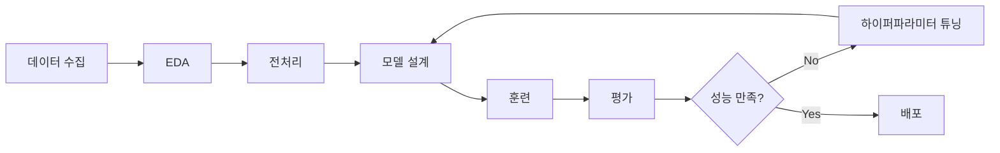
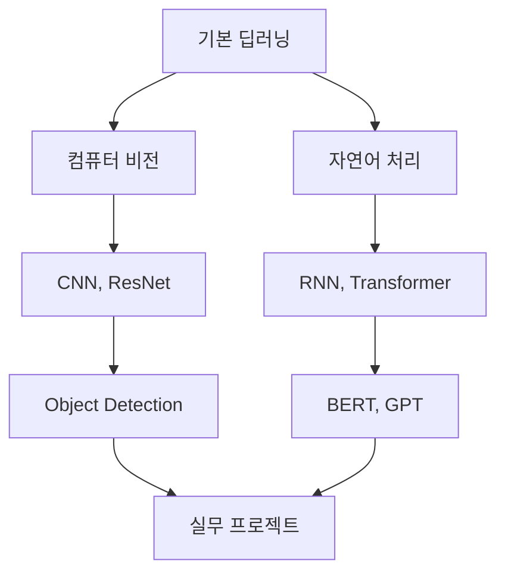

# 🧠 Deep Learning 정리

##### 🗓️ 2025.07.18
##### 📝 Writer : Moon19ht

---

## 📚 목차

1. [딥러닝 기본 개념](#1-딥러닝-기본-개념)
2. [데이터 전처리](#2-데이터-전처리)
3. [이진 분류 (Binary Classification)](#3-이진-분류-binary-classification)
4. [다중 분류 (Multi-class Classification)](#4-다중-분류-multi-class-classification)
5. [회귀 문제 (Regression)](#5-회귀-문제-regression)
6. [모델 평가 및 최적화](#6-모델-평가-및-최적화)
7. [실무 적용 가이드](#7-실무-적용-가이드)

---

## 1. 🎯 딥러닝 기본 개념

### 1.1 딥러닝이란?

**딥러닝(Deep Learning)**은 인공신경망을 여러 층으로 쌓아 복잡한 패턴을 학습하는 머신러닝의 한 분야입니다.

#### 📋 핵심 특징
- **다층 신경망**: 입력층, 은닉층, 출력층으로 구성
- **자동 특성 추출**: 수동 특성 공학 없이 데이터에서 자동으로 패턴 학습
- **비선형 변환**: 복잡한 함수 관계 모델링 가능
- **범용성**: 분류, 회귀, 생성 등 다양한 문제 해결

### 1.2 문제 유형별 분류

| 문제 유형 | 설명 | 출력층 | 손실함수 | 실습 예제 |
|-----------|------|--------|----------|-----------|
| **이진 분류** | 2개 클래스 분류 | Sigmoid (1개) | Binary Crossentropy | 꽃 분류 (데이지 vs 민들레) |
| **다중 분류** | 3개 이상 클래스 | Softmax (클래스 수) | Categorical Crossentropy | 쓰레기 분류 (6개 클래스) |
| **회귀** | 연속값 예측 | Linear (1개) | MSE | 주택 가격 예측 |

### 1.3 TensorFlow/Keras 기본 구조

```python
# 최신 권장 방식
import tensorflow as tf
from tensorflow.keras import models, layers

# 모델 생성
model = models.Sequential([
    layers.Input(shape=(input_dim,)),  # ⭐ 명시적 Input 레이어
    layers.Dense(units, activation='relu'),
    layers.Dense(output_units, activation='output_activation')
])

# 모델 컴파일
model.compile(
    optimizer='adam',
    loss='loss_function',
    metrics=['metric']
)
```

---

## 2. 📊 데이터 전처리

### 2.1 이미지 데이터 전처리 과정

#### 🔄 이미지 처리 파이프라인 (꽃 분류 실습 기반)

```python
from PIL import Image
import numpy as np

def process_image(image_path, target_size=(80, 80)):
    """이미지 전처리 표준 과정"""
    # 1. 이미지 로드
    img = Image.open(image_path)
    
    # 2. RGB 변환
    if img.mode != 'RGB':
        img = img.convert('RGB')
    
    # 3. 크기 통일
    img_resized = img.resize(target_size)
    
    # 4. NumPy 배열 변환
    pixel_array = np.array(img_resized)
    
    return pixel_array
```

#### 📦 데이터 저장 및 로드

```python
# NPZ 파일로 효율적 저장
np.savez('imagedata0_train.npz', data=images, targets=labels)

# 데이터 로드
data = np.load('imagedata0_train.npz')
X = data['data']
y = data['targets']
```

### 2.2 수치 데이터 정규화

#### 🎯 정규화의 필요성

**Boston Housing 실습**에서 확인된 스케일 차이:
- TAX: 188 ~ 711 (범위: 523)
- NOX: 0.39 ~ 0.87 (범위: 0.49)
- **스케일 차이 비율**: 1076:1 → 정규화 필수!

#### 📐 정규화 방법 선택

```python
from sklearn.preprocessing import Normalizer, StandardScaler

# L2 정규화 (딥러닝 권장)
normalizer = Normalizer(norm='l2')
X_train_scaled = normalizer.fit_transform(X_train)
X_test_scaled = normalizer.transform(X_test)  # Data Leakage 방지

# 표준화 (평균 0, 분산 1)
scaler = StandardScaler()
X_train_scaled = scaler.fit_transform(X_train)
X_test_scaled = scaler.transform(X_test)
```

### 2.3 데이터 분할 전략

```python
from sklearn.model_selection import train_test_split

# 계층화 분할 (클래스 비율 유지)
X_train, X_test, y_train, y_test = train_test_split(
    X, y, 
    test_size=0.3, 
    random_state=42, 
    stratify=y  # 클래스 분포 균등 유지
)
```

---

## 3. 🌸 이진 분류 (Binary Classification)

### 3.1 이진 분류 모델 설계

#### 🏗️ 아키텍처 구성 (꽃 분류 실습)

```python
def create_binary_model(input_shape):
    """이진 분류 모델 생성"""
    model = models.Sequential([
        layers.Input(shape=(input_shape,)),
        layers.Dense(128, activation='relu'),
        layers.Dropout(0.5),  # 과적합 방지
        layers.Dense(64, activation='relu'),
        layers.Dropout(0.5),
        layers.Dense(32, activation='relu'),
        layers.Dense(1, activation='sigmoid')  # 이진 분류 출력
    ])
    
    model.compile(
        optimizer='adam',
        loss='binary_crossentropy',  # 이진 분류 손실함수
        metrics=['accuracy', 'precision', 'recall', 'auc']
    )
    
    return model
```

### 3.2 핵심 설정 요소

| 구성요소 | 설정 | 이유 |
|----------|------|------|
| **출력층** | Dense(1, activation='sigmoid') | 0~1 확률 출력 |
| **손실함수** | binary_crossentropy | 이진 분류 최적화 |
| **임계값** | 0.5 | 분류 결정 기준 |
| **평가지표** | accuracy, precision, recall, auc | 다각도 성능 평가 |

### 3.3 모델 훈련 및 콜백

```python
# 콜백 설정
callbacks = [
    tf.keras.callbacks.EarlyStopping(
        monitor='val_loss',
        patience=10,
        restore_best_weights=True
    ),
    tf.keras.callbacks.ReduceLROnPlateau(
        monitor='val_loss',
        factor=0.5,
        patience=5
    )
]

# 훈련 실행
history = model.fit(
    X_train, y_train,
    epochs=100,
    batch_size=100,
    validation_split=0.2,
    callbacks=callbacks
)
```

### 3.4 성능 분석

#### 📊 주요 평가 지표

- **Accuracy**: 전체 정확도
- **Precision**: 양성 예측의 정확도
- **Recall**: 실제 양성의 탐지율
- **AUC**: ROC 곡선 아래 면적

#### 🎯 실습 결과 (데이지 vs 민들레)
- 최종 테스트 정확도: 약 55%
- 주요 이슈: 데이터 불균형, 모델 복잡도

---

## 4. 🗂️ 다중 분류 (Multi-class Classification)

### 4.1 다중 분류 모델 설계

#### 🏗️ 쓰레기 분류 모델 (6개 클래스)

```python
def create_multiclass_model(input_shape, num_classes=6):
    """다중 분류 모델 생성"""
    model = models.Sequential([
        layers.Input(shape=(input_shape,)),
        layers.Dense(512, activation='relu'),
        layers.Dropout(0.3),
        layers.Dense(256, activation='relu'),
        layers.Dropout(0.3),
        layers.Dense(128, activation='relu'),
        layers.Dropout(0.2),
        layers.Dense(64, activation='relu'),
        layers.Dropout(0.2),
        layers.Dense(num_classes, activation='softmax')  # 다중 분류 출력
    ])
    
    model.compile(
        optimizer='adam',
        loss='sparse_categorical_crossentropy',  # 다중 분류 손실함수
        metrics=['accuracy']
    )
    
    return model
```

### 4.2 클래스 정의 및 매핑

#### 🗑️ 쓰레기 분류 데이터셋

| 클래스 ID | 카테고리 | 설명 | 데이터 수 |
|-----------|----------|------|-----------|
| 0 | cardboard | 골판지, 박스 | 403개 |
| 1 | glass | 유리병, 유리컵 | 501개 |
| 2 | metal | 캔, 금속 용기 | 410개 |
| 3 | paper | 문서, 신문 | 594개 |
| 4 | plastic | 페트병, 플라스틱 | 482개 |
| 5 | trash | 기타 쓰레기 | 137개 |

### 4.3 데이터 불균형 처리

#### 📊 불균형 분석
- 최대: 594개 (paper)
- 최소: 137개 (trash)
- 불균형 비율: 4.34:1

#### 🔧 해결 방안
1. **계층화 분할**: `stratify=y` 사용
2. **클래스 가중치**: `class_weight='balanced'`
3. **데이터 증강**: 부족한 클래스 보강
4. **리샘플링**: SMOTE 등 활용

### 4.4 성능 평가

#### 📈 혼동 행렬 분석

```python
from sklearn.metrics import confusion_matrix, classification_report

# 예측 수행
y_pred = model.predict(X_test)
y_pred_classes = np.argmax(y_pred, axis=1)

# 혼동 행렬
cm = confusion_matrix(y_test, y_pred_classes)

# 분류 보고서
print(classification_report(y_test, y_pred_classes, 
                          target_names=class_names))
```

#### 🎯 실습 결과 (쓰레기 분류)
- 전체 정확도: 54.9%
- 클래스별 성능 편차 존재
- Trash 클래스: 높은 정밀도(1.00), 낮은 재현율(0.12)

---

## 5. 🏠 회귀 문제 (Regression)

### 5.1 회귀 모델 설계

#### 🏗️ Boston Housing 가격 예측 모델

```python
def create_regression_model(input_dim=13):
    """회귀 모델 생성 - 최신 권장 방식"""
    model = models.Sequential([
        layers.Input(shape=(input_dim,)),  # ⭐ 경고 해결
        layers.Dense(512, activation='relu'),
        layers.Dense(256, activation='relu'),
        layers.Dense(128, activation='relu'),
        layers.Dense(64, activation='relu'),
        layers.Dense(1)  # 선형 출력 (활성화 함수 없음)
    ])
    
    model.compile(
        optimizer='rmsprop',
        loss='mse',  # 평균제곱오차
        metrics=['mae']  # 평균절대오차
    )
    
    return model
```

### 5.2 회귀 문제 특성

#### 📊 분류 vs 회귀 비교

| 특성 | 분류 | 회귀 |
|------|------|------|
| **출력** | 클래스 라벨 | 연속값 |
| **활성화 함수** | sigmoid/softmax | 선형 (없음) |
| **손실함수** | crossentropy | MSE/MAE |
| **평가지표** | accuracy, precision | MAE, RMSE, R² |

### 5.3 데이터셋 분석

#### 🏘️ Boston Housing 특성

| 특성 | 설명 | 범위 | 중요도 |
|------|------|------|--------|
| **RM** | 평균 방 개수 | 3.6 ~ 8.8 | 높음 (상관관계 0.681) |
| **LSTAT** | 하위계층 비율 | 1.7 ~ 38.0% | 높음 |
| **TAX** | 재산세율 | 187 ~ 711 | 중간 |
| **NOX** | 질소산화물 농도 | 0.39 ~ 0.87 | 중간 |

### 5.4 성능 평가

#### 📊 주요 평가 지표

```python
# 성능 평가
test_loss, test_mae = model.evaluate(X_test, y_test)
predictions = model.predict(X_test)

# 추가 지표 계산
rmse = np.sqrt(test_loss)
correlation = np.corrcoef(y_test, predictions.flatten())[0, 1]

print(f"MAE: {test_mae:.3f} (평균 ${test_mae*1000:.0f} 오차)")
print(f"RMSE: {rmse:.3f}")
print(f"상관계수: {correlation:.3f}")
```

#### 🎯 실습 결과 (주택 가격 예측)
- MAE: 6.004 (평균 $6,004 오차)
- RMSE: 8.014
- 상관계수: 0.537

---

## 6. 📈 모델 평가 및 최적화

### 6.1 종합 평가 프레임워크

#### 📊 문제 유형별 핵심 지표

| 문제 유형 | 주요 지표 | 보조 지표 | 시각화 |
|-----------|-----------|-----------|---------|
| **이진 분류** | Accuracy, AUC | Precision, Recall | ROC Curve, 혼동행렬 |
| **다중 분류** | Accuracy, F1-score | 클래스별 Precision/Recall | 혼동행렬, 클래스별 성능 |
| **회귀** | MAE, RMSE | R², 상관계수 | 실제값 vs 예측값 산점도 |

### 6.2 과적합 진단 및 해결

#### 🔍 과적합 징후
1. **훈련 정확도 >> 검증 정확도**
2. **검증 손실이 상승 전환**
3. **훈련 곡선과 검증 곡선의 큰 격차**

#### 🛠️ 해결 방법

```python
# 1. 드롭아웃
layers.Dropout(0.5)

# 2. 조기 종료
EarlyStopping(monitor='val_loss', patience=10)

# 3. 학습률 감소
ReduceLROnPlateau(factor=0.5, patience=5)

# 4. 배치 정규화
layers.BatchNormalization()

# 5. L1/L2 정규화
layers.Dense(units, activation='relu', 
            kernel_regularizer=tf.keras.regularizers.l2(0.001))
```

### 6.3 하이퍼파라미터 최적화

#### ⚙️ 주요 하이퍼파라미터

| 파라미터 | 권장 범위 | 영향 |
|----------|-----------|------|
| **학습률** | 0.001 ~ 0.1 | 수렴 속도 및 안정성 |
| **배치 크기** | 32 ~ 128 | 학습 안정성 |
| **에포크** | 50 ~ 200 | 충분한 학습 시간 |
| **드롭아웃** | 0.2 ~ 0.5 | 과적합 방지 |

#### 🔧 튜닝 전략

```python
# 그리드 서치 예시
param_grid = {
    'batch_size': [32, 64, 128],
    'epochs': [50, 100, 150],
    'learning_rate': [0.001, 0.01, 0.1]
}

# Keras Tuner 활용
import keras_tuner as kt

def build_model(hp):
    model = models.Sequential()
    model.add(layers.Input(shape=(input_dim,)))
    
    # 하이퍼파라미터 탐색
    for i in range(hp.Int('num_layers', 2, 8)):
        model.add(layers.Dense(
            units=hp.Int(f'units_{i}', 32, 512, step=32),
            activation='relu'))
        model.add(layers.Dropout(
            hp.Float(f'dropout_{i}', 0, 0.5, step=0.1)))
    
    model.add(layers.Dense(1, activation='sigmoid'))
    
    model.compile(
        optimizer=tf.keras.optimizers.Adam(
            hp.Float('learning_rate', 1e-4, 1e-2, sampling='LOG')),
        loss='binary_crossentropy',
        metrics=['accuracy'])
    
    return model
```

### 6.4 모델 앙상블

#### 🤝 앙상블 기법

```python
# 투표 분류기
from sklearn.ensemble import VotingClassifier

# 여러 모델 결합
ensemble = VotingClassifier([
    ('nn1', model1),
    ('nn2', model2),
    ('nn3', model3)
], voting='soft')

# 스태킹
from sklearn.ensemble import StackingClassifier

stacking = StackingClassifier([
    ('nn', neural_network),
    ('rf', random_forest),
    ('svm', svm_model)
], final_estimator=LogisticRegression())
```

---

## 7. 💡 실무 적용 가이드

### 7.1 프로젝트 워크플로우

#### 🔄 표준 딥러닝 파이프라인



### 7.2 문제 유형별 적용 사례

#### 🌸 이진 분류 응용
- **의료 진단**: 질병 유/무 판별
- **스팸 필터링**: 스팸/정상 메일 분류
- **품질 검사**: 불량품 탐지
- **감성 분석**: 긍정/부정 감정 분류

#### 🗂️ 다중 분류 응용
- **이미지 인식**: 객체 분류
- **자연어 처리**: 문서 카테고리 분류
- **추천 시스템**: 선호도 분류
- **음성 인식**: 명령어 분류

#### 🏠 회귀 응용
- **가격 예측**: 부동산, 주식, 상품 가격
- **수요 예측**: 판매량, 방문자 수
- **위험 평가**: 신용도, 보험료
- **성능 예측**: 시스템 처리량, 효율성

### 7.3 배포 및 운영

#### 🚀 모델 배포 방법

```python
# 1. 모델 저장
model.save('model.h5')  # HDF5 형식
model.save('model.keras')  # 권장 형식

# 2. TensorFlow Serving
import tensorflow as tf

# SavedModel 형식으로 저장
tf.saved_model.save(model, 'saved_model_dir')

# 3. TensorFlow Lite (모바일/임베디드)
converter = tf.lite.TFLiteConverter.from_keras_model(model)
tflite_model = converter.convert()

# 4. REST API 구축
from flask import Flask, request, jsonify

app = Flask(__name__)
model = tf.keras.models.load_model('model.h5')

@app.route('/predict', methods=['POST'])
def predict():
    data = request.json
    prediction = model.predict(data)
    return jsonify(prediction.tolist())
```

### 7.4 성능 모니터링

#### 📊 운영 지표 추적

```python
# 모델 성능 모니터링
import mlflow

# 실험 추적
with mlflow.start_run():
    mlflow.log_param("epochs", epochs)
    mlflow.log_param("batch_size", batch_size)
    mlflow.log_metric("accuracy", accuracy)
    mlflow.log_metric("loss", loss)
    mlflow.keras.log_model(model, "model")

# 데이터 드리프트 감지
from scipy import stats

def detect_drift(reference_data, current_data):
    """데이터 분포 변화 감지"""
    _, p_value = stats.ks_2samp(reference_data, current_data)
    return p_value < 0.05  # 유의수준 5%
```

### 7.5 최신 트렌드 및 발전 방향

#### 🚀 주요 발전 동향

1. **Transfer Learning**: 사전 훈련된 모델 활용
2. **AutoML**: 자동화된 모델 선택 및 튜닝
3. **Federated Learning**: 분산 학습
4. **Explainable AI**: 해석 가능한 AI
5. **Edge Computing**: 엣지 디바이스 최적화

#### 💡 학습 로드맵



---

## 🎯 학습 정리 및 다음 단계

### ✅ 완료한 학습 내용

1. **이론적 기반**: 딥러닝 기본 개념과 문제 유형별 특성 이해
2. **실습 경험**: 이진분류, 다중분류, 회귀 문제 직접 구현
3. **기술적 숙련도**: TensorFlow/Keras 최신 API 활용법 습득
4. **문제 해결**: 데이터 전처리, 모델 설계, 성능 최적화 전 과정 경험

### 🚀 다음 학습 추천

1. **심화 아키텍처**: CNN, RNN 학습
2. **고급 기법**: Attention, Transformer 구조
3. **실무 스킬**: MLOps, 모델 배포 경험
4. **특화 도메인**: 컴퓨터 비전, NLP 전문화

### 💼 실무 적용 준비도

- ✅ **기본 프로젝트**: 즉시 수행 가능
- ✅ **데이터 전처리**: 다양한 데이터 타입 처리 가능
- ✅ **모델 구현**: 표준적인 딥러닝 모델 설계 및 훈련
- 🔄 **배포 경험**: 추가 학습 필요
- 🔄 **대규모 시스템**: 실무 경험 축적 필요

---

**🎉 축하합니다! 딥러닝의 핵심 개념과 실습을 모두 완료했습니다!**

