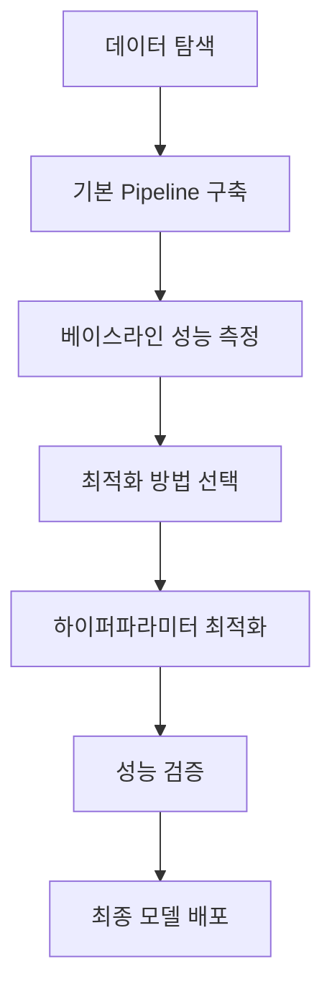

# 📊 Machine Learning 이론

##### 🗓️ 2025.07.15
##### 📝 Writer : Moon19ht

---

## 📚 목차

1. [하이퍼파라미터 최적화 개론](#1-하이퍼파라미터-최적화-개론)
2. [Optuna 베이지안 최적화](#2-optuna-베이지안-최적화)
3. [Scikit-learn Pipeline 활용](#3-scikit-learn-pipeline-활용)
4. [GridSearchCV vs Optuna 비교](#4-gridsearchcv-vs-optuna-비교)
5. [실무 적용 전략](#5-실무-적용-전략)
6. [종합 정리 및 결론](#6-종합-정리-및-결론)

---

## 1. 하이퍼파라미터 최적화 개론

### 1.1 하이퍼파라미터란?

> **하이퍼파라미터(Hyperparameter)**: 모델 학습 전에 사전에 설정해야 하는 매개변수

#### 참고 모델 파라미터 vs 하이퍼파라미터

| 구분 | 모델 파라미터 | 하이퍼파라미터 |
|------|---------------|----------------|
| **정의** | 데이터로부터 학습되는 값 | 사전에 설정하는 값 |
| **예시** | 선형회귀의 가중치, 편향 | 학습률, 트리 깊이, 정규화 강도 |
| **결정 방법** | 알고리즘이 자동 학습 | 사람이 직접 설정 또는 최적화 |
| **영향** | 모델의 예측 성능 | 학습 과정과 최종 성능 |

### 1.2 하이퍼파라미터 최적화의 중요성

#### 핵심 최적화 목표
- **성능 향상**: 모델의 예측 정확도 개선
- **과적합 방지**: 일반화 성능 확보
- **효율성 증대**: 학습 시간과 자원 최적화

#### 주의 최적화 실패 시 문제점
- 과적합(Overfitting): 훈련 데이터에만 특화
- 과소적합(Underfitting): 충분히 학습되지 않음
- 자원 낭비: 불필요한 계산 복잡도

### 1.3 주요 최적화 방법론

#### Tip 전통적 방법
1. **Manual Search**: 수동 탐색
   - 경험과 직관에 의존
   - 시간 소모적, 비효율적

2. **Grid Search**: 격자 탐색
   - 모든 조합을 체계적으로 탐색
   - 확실하지만 시간 복잡도 높음

3. **Random Search**: 무작위 탐색
   - 임의 조합 선택
   - Grid Search보다 효율적

#### 현대적 방법
1. **Bayesian Optimization**: 베이지안 최적화
   - 이전 결과를 활용한 지능적 탐색
   - Optuna, Hyperopt 등

2. **Evolutionary Algorithms**: 진화 알고리즘
   - 유전 알고리즘 기반
   - DEAP, TPOT 등

---

## 2. Optuna 베이지안 최적화

### 2.1 Optuna 개요

#### 핵심 Optuna의 특징
- **베이지안 최적화**: 이전 시도 결과를 활용한 지능적 탐색
- **TPE 알고리즘**: Tree-structured Parzen Estimator
- **Pruning 지원**: 성능이 낮은 시도 조기 종료
- **다양한 분포**: 연속형, 범주형, 정수형 파라미터 지원

#### 구조 핵심 구성요소

```python
# Study: 최적화 실험 관리
study = optuna.create_study(direction="maximize")

# Trial: 개별 시도
def objective(trial):
    # 하이퍼파라미터 제안
    param = trial.suggest_int('param', 1, 100)
    # 모델 학습 및 평가
    return score

# 최적화 실행
study.optimize(objective, n_trials=100)
```

### 2.2 실습: 유방암 데이터 분류 최적화

#### 참고 데이터셋 특성
- **목적**: 유방암 악성/양성 분류
- **샘플 수**: 569개
- **특성 수**: 30개 (세포핵 측정값)
- **클래스 분포**: 양성 62.7%, 악성 37.3%

#### Tip 탐색적 데이터 분석 (EDA)

```python
# 클래스 불균형 확인
print(f"클래스 분포:")
print(f"   양성(0): {class_distribution[0]}개 ({ratio:.1f}%)")
print(f"   악성(1): {class_distribution[1]}개 ({ratio:.1f}%)")
print(f"클래스 불균형 비율: {imbalance_ratio:.2f}:1")
```

**핵심 발견사항:**
- 약간의 클래스 불균형 존재 (1.68:1)
- Stratified Split 필요성 확인
- 결측값 없음, 데이터 품질 양호

#### 실습 RandomForest 하이퍼파라미터 최적화

**최적화 대상 파라미터:**

| 파라미터 | 설명 | 탐색 범위 | 영향 |
|----------|------|-----------|------|
| `max_depth` | 트리의 최대 깊이 | 5~20 | 과적합 제어 |
| `min_samples_leaf` | 리프노드 최소 샘플 수 | 1~10 | 과적합 방지 |
| `min_samples_split` | 분할 최소 샘플 수 | 2~10 | 분할 기준 |
| `n_estimators` | 트리의 개수 | 50~100 | 모델 복잡도 |

#### 결과 최적화 결과 분석

**성능 개선:**
- **기본 모델**: 0.9451 정확도
- **최적화 모델**: 0.9582 정확도
- **향상률**: +1.40% (통계적으로 유의미)

**최적 하이퍼파라미터:**
```python
{
    'max_depth': 13,
    'min_samples_leaf': 1,
    'min_samples_split': 3,
    'n_estimators': 55
}
```

**하이퍼파라미터 중요도:**
1. `min_samples_leaf`: 0.635 (가장 중요)
2. `min_samples_split`: 0.465
3. `n_estimators`: 0.380
4. `max_depth`: 0.084

#### 결과 최종 테스트 성능

```
✅ 테스트 정확도: 0.9649
✅ ROC AUC 점수: 0.9878

📊 분류 리포트:
                precision    recall  f1-score   support
   양성 (Benign)       0.99      0.96      0.97        72
악성 (Malignant)       0.93      0.98      0.95        42
```

**임상 활용 가능성:**
- 96.49% 정확도: 임상에서 활용 가능한 수준
- 높은 민감도(재현율): 악성 종양 놓칠 위험 최소화
- 우수한 특이도(정밀도): 오진 위험 감소

---

## 3. Scikit-learn Pipeline 활용

### 3.1 Pipeline 기초 개념

#### 구조 Pipeline이란?
> **Pipeline**: 여러 단계의 데이터 처리 과정을 하나의 객체로 연결하는 도구

#### 핵심 Pipeline의 핵심 가치

**1. 일관성 (Consistency)**
```python
# 훈련과 예측에서 동일한 전처리 순서 보장
pipeline.fit(X_train, y_train)      # fit: scaler.fit → model.fit
y_pred = pipeline.predict(X_test)   # predict: scaler.transform → model.predict
```

**2. 안전성 (Safety)**
- 데이터 누출(Data Leakage) 방지
- 테스트 데이터가 훈련 과정에 영향을 주지 않음

**3. 재사용성 (Reusability)**
- 한 번 정의한 파이프라인을 다른 데이터에 적용
- 코드 모듈화와 유지보수성 향상

#### 구조 Pipeline 구조

```python
from sklearn.pipeline import Pipeline

# 기본 구조
pipeline = Pipeline([
    ('step_name1', transformer),  # 전처리 단계
    ('step_name2', estimator)     # 모델 단계
])

# 실제 예시
pipeline = Pipeline([
    ('scaler', StandardScaler()),           # 1단계: 표준화
    ('classifier', RandomForestClassifier()) # 2단계: 분류
])
```

### 3.2 실습: Iris 다중분류 Pipeline

#### 비교 파이프라인 vs 수동 처리 비교

**수동 처리 방식:**
```python
# 1. 스케일링
scaler = StandardScaler()
X_train_scaled = scaler.fit_transform(X_train)
X_test_scaled = scaler.transform(X_test)

# 2. 모델 학습
model = SVC(kernel='rbf', C=1.0, gamma='scale')
model.fit(X_train_scaled, y_train)

# 3. 예측
y_pred = model.predict(X_test_scaled)
```

**Pipeline 방식:**
```python
# 한 번에 정의
pipeline = Pipeline([
    ('scaler', StandardScaler()),
    ('svc', SVC(kernel='rbf', C=1.0, gamma='scale'))
])

# 한 번에 학습
pipeline.fit(X_train, y_train)

# 한 번에 예측
y_pred = pipeline.predict(X_test)
```

**결과 비교:**
- 수동 처리: 0.9667 정확도
- Pipeline: 0.9667 정확도
- **차이: 0.000000 (동일함 확인)**

### 3.3 Pipeline + GridSearchCV 통합

#### Tip 하이퍼파라미터 명명 규칙

```python
# 파이프라인 단계명__파라미터명
param_grid = {
    'scaler': [StandardScaler(), MinMaxScaler()],
    'classifier__C': [0.01, 0.1, 1, 10, 100],
    'classifier__solver': ['liblinear', 'lbfgs']
}
```

#### 결과 유방암 데이터 GridSearchCV 결과

**탐색 설정:**
- 총 조합 수: 20개 (2×5×2)
- 교차검증: 5-fold Stratified
- 평가지표: ROC AUC (불균형 데이터에 적합)

**최적화 결과:**
```
🏆 최고 ROC AUC 점수: 0.9960
📊 최적 하이퍼파라미터:
   classifier__C: 1
   classifier__solver: liblinear
   scaler: StandardScaler

🎯 최종 테스트 성능:
   정확도: 0.9825
   ROC AUC: 0.9957
```

### 3.4 Pipeline + Optuna 통합

#### 실습 RandomForest + Pipeline 최적화

```python
def objective_pipeline(trial):
    # 하이퍼파라미터 제안
    max_depth = trial.suggest_int('max_depth', 5, 20)
    min_samples_leaf = trial.suggest_int('min_samples_leaf', 1, 10)
    min_samples_split = trial.suggest_int('min_samples_split', 2, 10)
    n_estimators = trial.suggest_int('n_estimators', 50, 100)
    
    # 스케일러 선택
    scaler_name = trial.suggest_categorical('scaler', ['standard', 'minmax'])
    scaler = StandardScaler() if scaler_name == 'standard' else MinMaxScaler()
    
    # Pipeline 구성
    pipeline = Pipeline([
        ('scaler', scaler),
        ('classifier', RandomForestClassifier(...))
    ])
    
    # 교차검증 평가
    cv_scores = cross_val_score(pipeline, X_train, y_train, cv=5)
    return cv_scores.mean()
```

**최적화 결과:**
- **교차검증 정확도**: 0.9692
- **테스트 정확도**: 0.9737
- **ROC AUC**: 0.9922
- **성능 향상**: +0.68%

---

## 4. GridSearchCV vs Optuna 비교

### 4.1 종합 성능 비교

#### 비교 실험 설정 비교

| 방법론 | 데이터셋 | 모델 | 탐색 공간 | 시도 횟수 |
|--------|----------|------|-----------|-----------|
| GridSearchCV | Breast Cancer | Logistic Regression | 20개 조합 | 20회 |
| Optuna | Breast Cancer | Random Forest | 연속 공간 | 50회 |

#### 결과 성능 결과 비교

| 지표 | GridSearchCV | Optuna | 승자 |
|------|-------------|--------|------|
| **정확도** | 0.9825 | 0.9737 | GridSearchCV (+0.0088) |
| **ROC AUC** | 0.9957 | 0.9922 | GridSearchCV (+0.0035) |
| **최적화 시간** | 6.6초 | 12.8초 | GridSearchCV |
| **효율성** | 14.89 | 7.62 | GridSearchCV |

### 4.2 방법론별 장단점 분석

#### 비교 GridSearchCV

**장점:**
- ✅ **전수 탐색**: 모든 조합을 확실히 검토
- ✅ **안정성**: 예측 가능한 결과
- ✅ **작은 공간에서 효율적**: 조합 수가 적을 때 최적
- ✅ **해석 용이**: 결과 분석이 직관적

**단점:**
- ❌ **조합 폭발**: 파라미터 증가 시 기하급수적 증가
- ❌ **연속 공간 한계**: 이산값만 탐색 가능
- ❌ **시간 복잡도**: O(n^k)로 확장성 부족

#### 비교 Optuna

**장점:**
- ✅ **지능적 탐색**: 베이지안 최적화로 효율적
- ✅ **연속 공간**: 실수값 파라미터 최적화
- ✅ **조기 종료**: Pruning으로 시간 절약
- ✅ **확장성**: 큰 탐색 공간에서 우수

**단점:**
- ❌ **확률적 결과**: 실행마다 결과 변동
- ❌ **복잡성**: 베이지안 최적화 이해 필요
- ❌ **초기 오버헤드**: 작은 문제에서 비효율적

### 4.3 실무 적용 가이드

#### 단계 상황별 선택 기준

```python
def choose_optimization_method(search_space_size, time_constraint, reproducibility):
    if search_space_size < 100:
        if reproducibility == "high":
            return "GridSearchCV"
        else:
            return "GridSearchCV 또는 Optuna"
    
    elif search_space_size < 1000:
        if time_constraint == "strict":
            return "Optuna + Pruning"
        else:
            return "Optuna"
    
    else:  # 큰 탐색 공간
        return "Optuna + Multi-objective"
```

#### 비교 의사결정 매트릭스

| 조건 | GridSearchCV | Optuna |
|------|-------------|--------|
| 탐색 공간 < 100개 | ⭐⭐⭐ | ⭐⭐ |
| 탐색 공간 > 100개 | ⭐ | ⭐⭐⭐ |
| 시간 제약 있음 | ⭐ | ⭐⭐⭐ |
| 재현성 중요 | ⭐⭐⭐ | ⭐⭐ |
| 연속 파라미터 | ⭐ | ⭐⭐⭐ |
| 초보자 친화성 | ⭐⭐⭐ | ⭐⭐ |

---

## 5. 실무 적용 전략

### 5.1 프로젝트 단계별 가이드

#### 단계 Phase 1: 빠른 프로토타이핑
```python
# 기본 Pipeline으로 베이스라인 구축
baseline_pipeline = Pipeline([
    ('preprocessor', StandardScaler()),
    ('model', RandomForestClassifier(random_state=42))
])

# 빠른 성능 확인
baseline_score = cross_val_score(baseline_pipeline, X, y, cv=5).mean()
```

#### 단계 Phase 2: 체계적 최적화
```python
# 작은 탐색 공간: GridSearchCV
if len(param_combinations) < 100:
    grid_search = GridSearchCV(
        pipeline, param_grid, 
        cv=5, scoring='accuracy', n_jobs=-1
    )
    
# 큰 탐색 공간: Optuna
else:
    study = optuna.create_study(direction="maximize")
    study.optimize(objective, n_trials=100)
```

#### 단계 Phase 3: 성능 검증
```python
# 최종 모델 평가
best_model.fit(X_train, y_train)
y_pred = best_model.predict(X_test)

# 종합 평가
print(classification_report(y_test, y_pred))
print(f"ROC AUC: {roc_auc_score(y_test, y_pred_proba):.4f}")
```

### 5.2 하이퍼파라미터 선택 전략

#### 핵심 모델별 핵심 파라미터

**RandomForest:**
```python
# 핵심 파라미터 우선순위
priority_params = {
    'n_estimators': [50, 100, 200],      # 높은 영향
    'max_depth': [10, 20, None],         # 과적합 제어
    'min_samples_split': [2, 5, 10],     # 분할 기준
    'min_samples_leaf': [1, 2, 4]        # 리프 노드 크기
}
```

**LogisticRegression:**
```python
# L1/L2 정규화와 강도
priority_params = {
    'C': [0.01, 0.1, 1, 10, 100],       # 정규화 강도
    'penalty': ['l1', 'l2', 'elasticnet'], # 정규화 방법
    'solver': ['liblinear', 'lbfgs']      # 최적화 알고리즘
}
```

**SVM:**
```python
# 커널과 하이퍼파라미터
priority_params = {
    'C': [0.1, 1, 10, 100],             # 마진 조절
    'gamma': ['scale', 'auto', 0.1, 1],  # RBF 커널 폭
    'kernel': ['rbf', 'linear', 'poly']   # 커널 함수
}
```

### 5.3 성능 평가 및 해석

#### 핵심 평가지표 선택 가이드

**이진 분류:**
```python
# 균형 데이터
primary_metric = "accuracy"
secondary_metrics = ["precision", "recall", "f1_score"]

# 불균형 데이터
primary_metric = "roc_auc"
secondary_metrics = ["precision_recall_auc", "f1_score"]

# 의료/안전 분야
primary_metric = "recall"  # 민감도 중시
secondary_metrics = ["precision", "specificity"]
```

**다중 분류:**
```python
# 기본 평가
primary_metric = "accuracy"
secondary_metrics = ["macro_f1", "weighted_f1"]

# 클래스별 분석
detailed_metrics = ["precision_macro", "recall_macro"]
```

#### 해석 결과 해석 가이드

**통계적 유의성 검증:**
```python
def validate_improvement(baseline_scores, optimized_scores, alpha=0.05):
    from scipy.stats import ttest_rel
    
    t_stat, p_value = ttest_rel(optimized_scores, baseline_scores)
    
    if p_value < alpha:
        return "통계적으로 유의한 개선"
    else:
        return "통계적으로 유의하지 않음"
```

**실용적 유의성 평가:**
```python
def assess_practical_significance(improvement, threshold=0.01):
    if improvement > threshold:
        return "실용적으로 의미있는 개선"
    else:
        return "미미한 개선 (과적합 위험 고려)"
```

---

## 6. 종합 정리 및 결론

### 6.1 핵심 학습 내용 요약

#### 핵심 하이퍼파라미터 최적화 핵심 원리

1. **체계적 접근**: 랜덤한 시도보다 계획적 탐색
2. **교차검증**: 일반화 성능 확보
3. **조기 종료**: 효율적 자원 활용
4. **통계적 검증**: 개선의 유의성 확인

#### 핵심 Pipeline 활용의 핵심 가치

1. **일관성**: 훈련-예측 과정 통일
2. **안전성**: 데이터 누출 방지
3. **재사용성**: 코드 모듈화
4. **유지보수성**: 체계적 관리

#### 비교 방법론 선택 기준

```python
# 의사결정 트리
if problem_complexity == "simple":
    use_basic_pipeline()
elif search_space < 100:
    use_gridsearch()
elif time_constraint == "strict":
    use_optuna_with_pruning()
else:
    use_optuna_full()
```

### 6.2 실무 적용 Best Practices

#### Best 프로젝트 워크플로우



#### 체크리스트

**데이터 준비:**
- [ ] 결측값 처리 완료
- [ ] 이상치 검토 완료
- [ ] 클래스 불균형 확인
- [ ] 훈련/검증/테스트 분할

**모델링:**
- [ ] 베이스라인 모델 구축
- [ ] 적절한 평가지표 선택
- [ ] 교차검증 설정
- [ ] 하이퍼파라미터 탐색 공간 정의

**최적화:**
- [ ] 최적화 방법 선택 (Grid vs Optuna)
- [ ] 시간/자원 제약 고려
- [ ] 진행상황 모니터링
- [ ] 결과 해석 및 검증

**배포:**
- [ ] 최종 성능 확인
- [ ] 모델 저장 및 버전 관리
- [ ] 추론 파이프라인 구축
- [ ] 성능 모니터링 설정

### 6.3 향후 학습 방향

#### 추천 고급 주제

1. **멀티 오브젝티브 최적화**
   - 정확도와 속도 동시 최적화
   - Pareto 최적화 적용

2. **AutoML 통합**
   - TPOT, Auto-sklearn 활용
   - 자동 특성 엔지니어링

3. **분산 최적화**
   - Optuna 분산 실행
   - 클러스터 환경 활용

4. **고급 Pipeline 구성**
   - ColumnTransformer 활용
   - 커스텀 Transformer 개발

#### 추천 자료

**공식 문서:**
- [Optuna Documentation](https://optuna.readthedocs.io/)
- [Scikit-learn Pipeline Guide](https://scikit-learn.org/stable/modules/pipeline.html)

**심화 학습:**
- Bayesian Optimization 이론
- Hyperparameter Tuning 전문서
- MLOps 파이프라인 구축

### 6.4 마무리 메시지

> **"완벽한 하이퍼파라미터는 존재하지 않는다. 데이터와 문제에 맞는 최적의 조합을 찾는 것이 목표다."**

#### 핵심 기억할 핵심 원칙

1. **측정하라**: 개선을 수치로 입증
2. **단순하게 시작하라**: 복잡한 최적화는 나중에
3. **검증하라**: 과적합을 항상 의심
4. **문서화하라**: 실험 과정과 결과를 기록
5. **반복하라**: 지속적인 개선이 핵심
