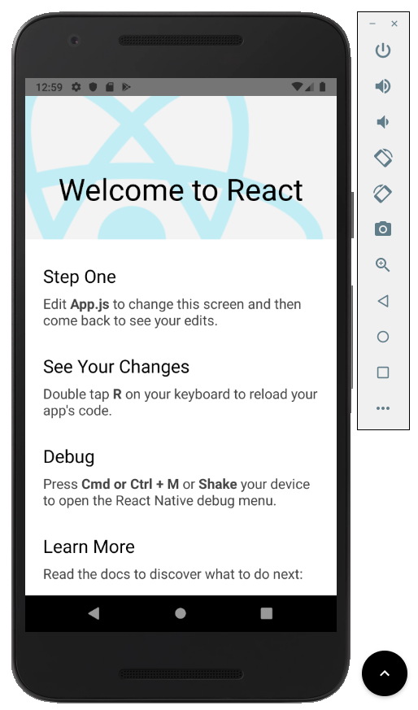
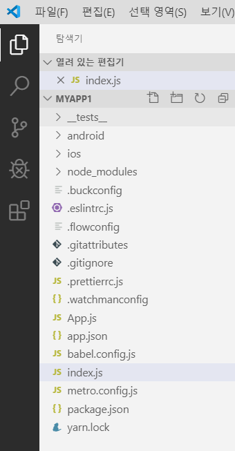
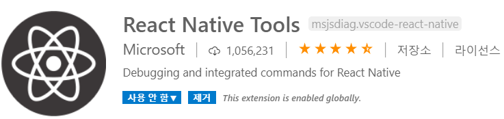
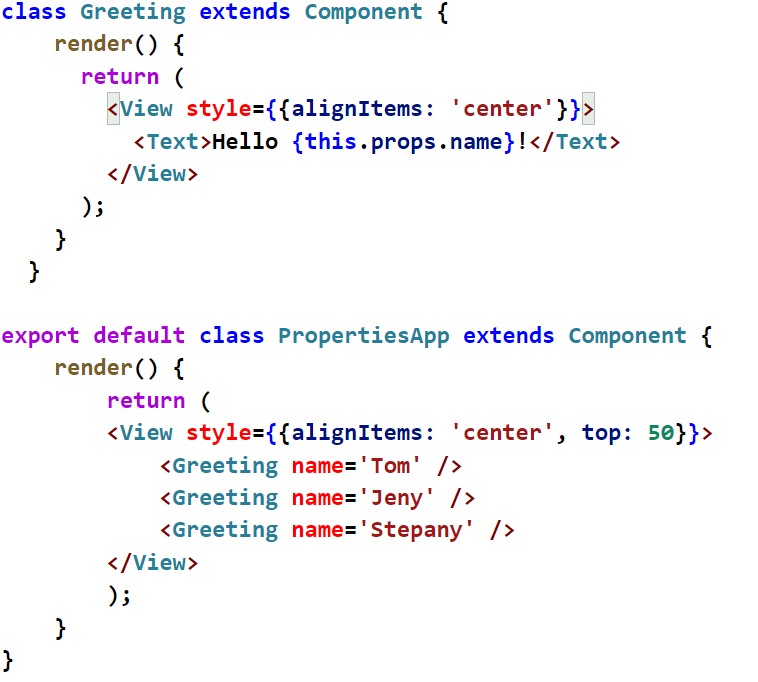
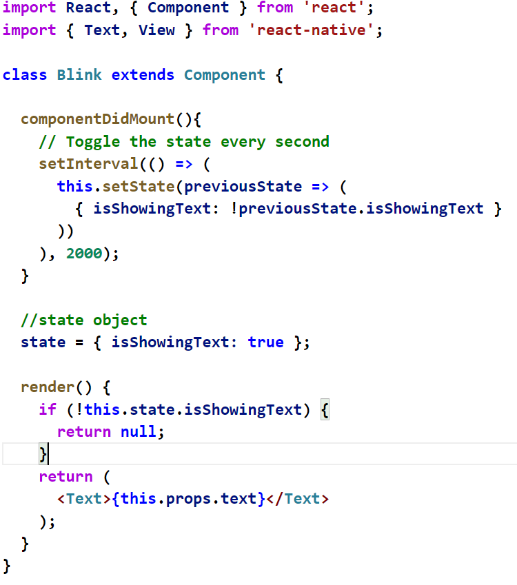
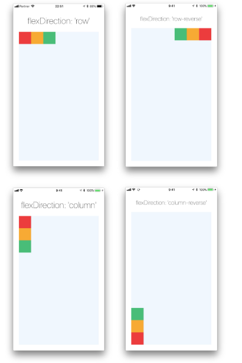
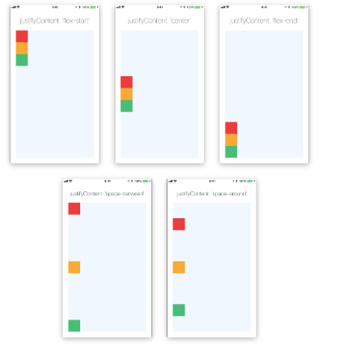
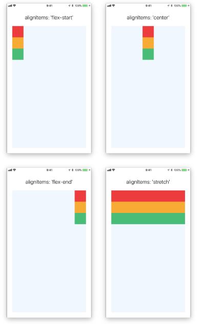

# React Native 시작하기: 종합 가이드

이 문서는 React Native를 시작하는 데 필요한 모든 것을 다루는 종합 가이드입니다. 모바일 앱 개발의 종류부터 시작하여 React Native의 핵심 개념과 실제 프로젝트 생성까지 단계별로 안내합니다.

---

## 1. 모바일 앱의 종류

모바일 애플리케이션은 크게 세 가지 유형으로 나눌 수 있습니다.

### 1.1. 네이티브 앱 (Native App)
- **설명**: 안드로이드(Java/Kotlin)나 iOS(Swift/Objective-C) 등 특정 플랫폼에 최적화된 언어로 개발된 앱입니다.
- **장점**: 성능이 가장 뛰어나고 안정적이며, 기기의 모든 기능을 활용할 수 있습니다.
- **단점**: 플랫폼별로 코드를 따로 작성해야 하므로 개발 비용과 시간이 많이 듭니다.

### 1.2. 웹앱 (Web App)
- **설명**: 모바일 브라우저에서 동작하는 웹사이트입니다. HTML, CSS, JavaScript를 사용하여 개발됩니다.
- **장점**: 하나의 코드로 모든 플랫폼에서 동작하며, 설치가 필요 없습니다.
- **단점**: 네이티브 앱에 비해 성능이 느리고, 기기 기능 접근에 제약이 있습니다. iOS에서는 스토어 등록이 어렵습니다.

### 1.3. 하이브리드 앱 (Hybrid App)
- **설명**: 웹 기술(HTML, CSS, JS)로 개발하지만, 네이티브 앱처럼 패키징하여 스토어에 배포하는 형태입니다. 웹앱과 네이티브 앱의 장점을 결합한 방식입니다.
- **작동 원리**: 웹뷰(WebView)라는 네이티브 컨테이너 안에서 웹페이지를 실행하는 구조입니다. 카메라, 센서 등 기기 기능은 네이티브 API를 통해 접근합니다.
- **React Native**가 바로 이 하이브리드 앱 개발을 위한 대표적인 프레임워크입니다.

---

## 2. React Native란?

**React Native**는 Facebook에서 개발한 오픈소스 프레임워크로, JavaScript와 React를 사용하여 네이티브 수준의 모바일 앱을 만들 수 있게 해줍니다. "Learn once, write anywhere"라는 철학을 바탕으로, 하나의 코드베이스로 Android와 iOS 앱을 동시에 개발할 수 있습니다.

### 2.1. 주요 특징
- **크로스 플랫폼**: 한 번의 개발로 Android와 iOS 모두를 지원합니다.
- **네이티브 성능**: 웹뷰를 사용하는 다른 하이브리드 앱과 달리, 실제 네이티브 UI 컴포넌트로 렌더링되어 뛰어난 성능을 제공합니다.
- **재사용 가능한 컴포넌트**: UI를 독립적인 컴포넌트로 나누어 개발하므로 코드 재사용성이 높고 유지보수가 용이합니다.
- **강력한 커뮤니티**: 거대한 개발자 커뮤니티와 풍부한 라이브러리 생태계를 갖추고 있습니다.
- **빠른 개발 속도**: Hot Reloading 기능을 지원하여 코드를 수정한 후 즉시 앱에 반영된 모습을 확인할 수 있습니다.

**주요 사용 사례**: Facebook, Instagram, Uber Eats, Walmart 등 많은 글로벌 기업들이 React Native를 사용하고 있습니다.

---

## 3. 개발 환경 설정

React Native 개발을 시작하기 위해 필요한 프로그램들을 설치하고 환경을 설정합니다.

### 3.1. 필수 프로그램
- **Node.js**: React Native 패키지를 관리하고, Metro 번들러(웹 서버)를 실행하는 데 필요합니다. (v10 이상 권장)
- **JDK (Java Development Kit)**: Android 앱을 빌드하기 위해 필요합니다.
- **Python**: 일부 빌드 스크립트 실행에 필요합니다.
- **Android Studio**: Android 개발 환경, SDK, 그리고 가상 디바이스(에뮬레이터)를 제공합니다.

### 3.2. 설치 과정

#### 1. Node.js 및 Python 설치
- [Node.js 공식 웹사이트](https://nodejs.org/)에서 LTS 버전을 다운로드하여 설치합니다.
- [Python 공식 웹사이트](https://www.python.org/)에서 최신 버전을 설치합니다.

#### 2. JDK 설치 및 환경 변수 설정
1.  Oracle 웹사이트 등에서 JDK (예: 버전 8)를 설치합니다.
2.  **환경 변수**를 설정합니다.
    - `JAVA_HOME`: JDK가 설치된 경로 (예: `C:\Program Files\Java\jdk1.8.0_201`)
    - `Path`: 시스템 경로에 `%JAVA_HOME%\bin` 추가

#### 3. Android Studio 설치 및 환경 변수 설정
1.  [Android Studio 공식 웹사이트](https://developer.android.com/studio)에서 설치 파일을 다운로드하여 설치합니다.
2.  Android Studio 실행 후, SDK Manager에서 다음 항목을 설치합니다.
    - `Android SDK Platform 28` (또는 최신 버전)
    - `Intel x86 Atom_64 System Image` (에뮬레이터용)
3.  **환경 변수**를 설정합니다.
    - `ANDROID_HOME`: Android SDK 경로 (예: `C:\Users\your-user\AppData\Local\Android\Sdk`)
    - `Path`: 시스템 경로에 `%ANDROID_HOME%\platform-tools` 추가
4.  AVD Manager를 통해 가상 디바이스(예: Nexus 5X API 28)를 생성하고 실행합니다.

---

## 4. 첫 React Native 프로젝트 생성 및 실행

### 4.1. 프로젝트 생성
터미널(CMD 또는 PowerShell)을 열고 다음 명령어를 순서대로 실행합니다.

```bash

# 1. 작업 폴더로 이동
cd c:\react_native_workspace

# 2. 'MyApp'이라는 이름의 새 프로젝트 생성
npx react-native init MyApp

# 3. 프로젝트 폴더로 이동
cd MyApp
```

### 4.2. 앱 실행
Android 에뮬레이터가 실행 중인 상태에서 다음 명령어를 입력하여 앱을 실행합니다.

```bash
npx react-native run-android
```



### 4.3. 프로젝트 구조
- **`package.json`**: 프로젝트의 정보와 의존성(라이브러리) 목록을 관리하는 파일입니다.
- **`App.js`**: 앱이 처음 실행될 때 표시되는 메인 컴포넌트 파일입니다.
- **`android` / `ios`**: 각 플랫폼별 네이티브 코드가 담긴 폴더입니다.



---

## 5. 개발 도구: Visual Studio Code

**Visual Studio Code (VS Code)**는 React Native 개발에 가장 널리 사용되는 코드 에디터입니다. 다음 확장 프로그램을 설치하면 개발 효율성을 높일 수 있습니다.

- **React Native Tools**: 디버깅, 자동 완성 등 다양한 기능을 제공합니다.
- **ES7+ React/Redux/React-Native snippets**: 유용한 코드 스니펫을 제공하여 코드 작성을 도와줍니다.



---

## 6. React Native 핵심 개념: 자세히 알아보기

### 6.1. Props (프로퍼티)
**`props`**는 부모 컴포넌트에서 자식 컴포넌트로 데이터를 전달하기 위한 읽기 전용(read-only) 객체입니다. 이를 통해 재사용 가능한 컴포넌트를 만들 수 있습니다.

#### 사용법
1.  **자식 컴포넌트 생성**: `props`를 인자로 받아 UI를 렌더링하는 컴포넌트를 만듭니다.
2.  **부모 컴포넌트에서 값 전달**: 자식 컴포넌트를 사용할 때, HTML의 속성(attribute)처럼 `prop`의 이름과 값을 전달합니다.

#### 예제 코드
`App.js` 파일에 아래 코드를 작성해보세요. `Greeting`이라는 자식 컴포넌트에 `name`이라는 `prop`을 전달하는 예제입니다.

```javascript
import React from 'react';
import { Text, View } from 'react-native';

// 자식 컴포넌트
const Greeting = (props) => {
  return (
    <View style={{alignItems: 'center'}}>
      <Text>Hello, {props.name}!</Text>
    </View>
  );
};

// 부모 컴포넌트
const App = () => {
  return (
    <View style={{flex: 1, justifyContent: 'center', alignItems: 'center'}}>
      <Greeting name="Rexxar" />
      <Greeting name="Jaina" />
      <Greeting name="Uther" />
    </View>
  );
};

export default App;
```


### 6.2. State (상태)
**`state`**는 컴포넌트가 내부적으로 가지는 동적인 데이터입니다. 사용자의 인터랙션 등으로 인해 데이터가 변해야 할 때 `state`를 사용합니다. `state`가 변경되면 컴포넌트는 자동으로 다시 렌더링됩니다.

#### 사용법
1.  **State 초기화**: 클래스 컴포넌트의 `constructor` 또는 함수형 컴포넌트의 `useState` 훅을 사용하여 `state`의 초기값을 설정합니다.
2.  **State 값 사용**: `this.state.변수명` (클래스형) 또는 `변수명` (함수형)으로 `state` 값을 읽습니다.
3.  **State 값 변경**: 반드시 `this.setState({ ... })` (클래스형) 또는 `set변수명(...)` (함수형)을 사용하여 값을 변경해야 합니다.

#### 예제 코드
버튼을 누를 때마다 숫자가 증가하는 간단한 카운터 예제입니다.

```javascript
import React, { useState } from 'react';
import { Button, Text, View, StyleSheet } from 'react-native';

const Counter = () => {
  const [count, setCount] = useState(0);

  return (
    <View style={styles.container}>
      <Text style={styles.text}>You clicked {count} times</Text>
      <Button
        onPress={() => setCount(count + 1)}
        title="Click me!"
      />
    </View>
  );
};

const styles = StyleSheet.create({
  container: {
    flex: 1,
    justifyContent: 'center',
    alignItems: 'center'
  },
  text: {
    fontSize: 20,
    marginBottom: 20
  }
});

export default Counter;
```


### 6.3. Styling
React Native에서는 `StyleSheet.create`를 사용하여 스타일 객체를 만드는 것을 권장합니다. 이렇게 하면 코드를 정리하고 성능을 최적화할 수 있습니다.

#### 예제 코드
`StyleSheet`를 사용하여 여러 컴포넌트에 스타일을 적용하는 예제입니다.

```javascript
import React from 'react';
import { StyleSheet, Text, View } from 'react-native';

const App = () => {
  return (
    <View style={styles.container}>
      <Text style={styles.title}>React Native</Text>
      <Text style={styles.subtitle}>Styling Example</Text>
    </View>
  );
};

const styles = StyleSheet.create({
  container: {
    flex: 1,
    backgroundColor: '#fff',
    alignItems: 'center',
    justifyContent: 'center',
  },
  title: {
    fontSize: 30,
    fontWeight: 'bold',
    color: 'blue',
  },
  subtitle: {
    fontSize: 20,
    color: 'gray',
  },
});

export default App;
```

### 6.4. 레이아웃과 Flexbox
**Flexbox**는 React Native에서 UI 레이아웃을 구성하는 핵심 시스템입니다. `flex`, `flexDirection`, `justifyContent`, `alignItems` 등의 속성을 조합하여 복잡한 UI도 쉽게 구성할 수 있습니다.

#### 예제 코드
Flexbox를 사용하여 화면을 세 개의 다른 색상 영역으로 나누는 예제입니다.

```javascript
import React from 'react';
import { View } from 'react-native';

const App = () => {
  return (
    // flexDirection: 'column' (기본값)
    <View style={{flex: 1}}>
      <View style={{flex: 1, backgroundColor: 'powderblue'}} />
      <View style={{flex: 2, backgroundColor: 'skyblue'}} />
      <View style={{flex: 3, backgroundColor: 'steelblue'}} />
    </View>
  );
};

export default App;
```
이 코드는 화면을 세로로 1:2:3 비율의 세 영역으로 나눕니다. `flexDirection`을 `'row'`로 바꾸면 가로로 분할됩니다.

| `flexDirection` | `justifyContent` | `alignItems` |
| :--- | :--- | :--- |
|  |  |  |

이제 React Native 개발을 시작할 준비가 되었습니다. 이 가이드를 바탕으로 멋진 앱을 만들어보세요!
